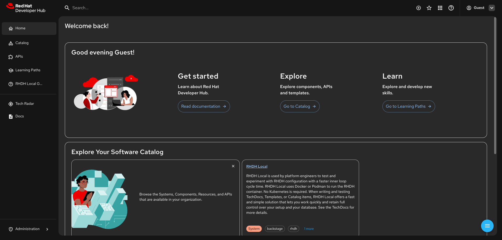

# RHDH Local

The fastest and simplest way for platform engineers to test Red Hat Developer Hub (RHDH) features locally.

RHDH Local lets you quickly test software catalogs, TechDocs, plugins, templates, and configurations without needing a cluster. Perfect for individual development and testing on your laptop, desktop, or homelab.

> [!CAUTION]
>
> - RHDH Local is **NOT a substitute for Red Hat Developer Hub**.
> - It is for development and testing only, **not for production use**.
> - It is designed for individual developers try out various RHDH features, not for teams as there is no out-of-the-box RBAC support.
> - There is no official, commercial support for RHDH Local. Use RHDH Local at your own risk.

## Quick Start

1. **Prerequisites**: [Podman](https://podman.io/docs/installation) v5.4.1+ (recommended) or [Docker](https://docs.docker.com/engine/) v28.1.0+ with Compose support

2. **Clone and start**:

   ```sh
   git clone https://github.com/redhat-developer/rhdh-local.git && cd rhdh-local
   podman compose up -d  # or: docker compose up -d
   ```

3. **Access**: Open [http://localhost:7007](http://localhost:7007) and log in as 'Guest'



## Built-in Documentation

RHDH Local includes comprehensive technical TechDocs covering everything you need to know about it. Once running, access the documentation directly in the application for detailed guides on:

- **Getting Started**: Understanding RHDH Local's purpose and capabilities
- **Loading Content**: Adding catalogs, templates, and TechDocs
- **Dynamic Plugins**: Installing, configuring, and developing plugins
- **GitHub Integration**: Setting up authentication and content fetching
- **Local Development**: Working with plugins and configurations
- **Operations**: Running, restarting, and troubleshooting

The built-in documentation provides step-by-step technical instructions with examples.

## Quick Commands

### After Plugin changes

After modifying the plugins configuration, for example after configuring plugins using the Extensions in the RHDH UI:

```sh
# Reinstall plugins and restart RHDH
podman compose run install-dynamic-plugins
podman compose restart rhdh
```

### Quick restart (No Plugin changes)

For configuration-only changes:

```sh
# Just restart RHDH (if plugins haven't changed)
podman compose restart rhdh
```

### Clean up

```sh
podman compose down --volumes
```

## Additional Configuration Guides

If you would like to change your RHDH-Local setup, or add additional features or plugins, please check out the guides below.

1. [Plugins Guide](./docs/rhdh-local-guide/plugins-guide.md) - how to include your own plugins
2. [Container Image Guide](docs/rhdh-local-guide/container-image-guide.md) - how to switch to a more bleeding edge, or commercially supported version of RHDH
3. [Simulated Proxy Setup](docs/rhdh-local-guide/corporate-proxy-setup-sim.md) - testing in a simulated proxy environment
4. [PostgreSQL Guide](docs/rhdh-local-guide/postgresql-guide.md) - using PostgreSQL instead of an in-memory database
5. [Orchestrator Workflow Guide](./orchestrator/README.md) - using Orchestrator with RHDH to develop workflows.
6. [Developer Lightspeed Guide](./developer-lightspeed/README.md) - using Developer Lightspeed in RHDH Local.

## Contributing and reporting issues

To report issues against this repository, please use [JIRA](https://issues.redhat.com/browse/RHIDP) with Component: **RHDH Local**

To browse the existing issues, you can use this [Query](https://issues.redhat.com/issues/?filter=-4&jql=project%20%3D%20%22Red%20Hat%20Internal%20Developer%20Platform%22%20%20AND%20component%20%3D%20%22RHDH%20Local%22%20AND%20resolution%20%3D%20Unresolved%20ORDER%20BY%20status%2C%20priority%2C%20updated%20%20%20%20DESC).

Contributions are welcome!

## License

```txt
Copyright Red Hat

Licensed under the Apache License, Version 2.0 (the "License");
you may not use this file except in compliance with the License.
You may obtain a copy of the License at

   http://www.apache.org/licenses/LICENSE-2.0

Unless required by applicable law or agreed to in writing, software
distributed under the License is distributed on an "AS IS" BASIS,
WITHOUT WARRANTIES OR CONDITIONS OF ANY KIND, either express or implied.
See the License for the specific language governing permissions and
limitations under the License.
```
