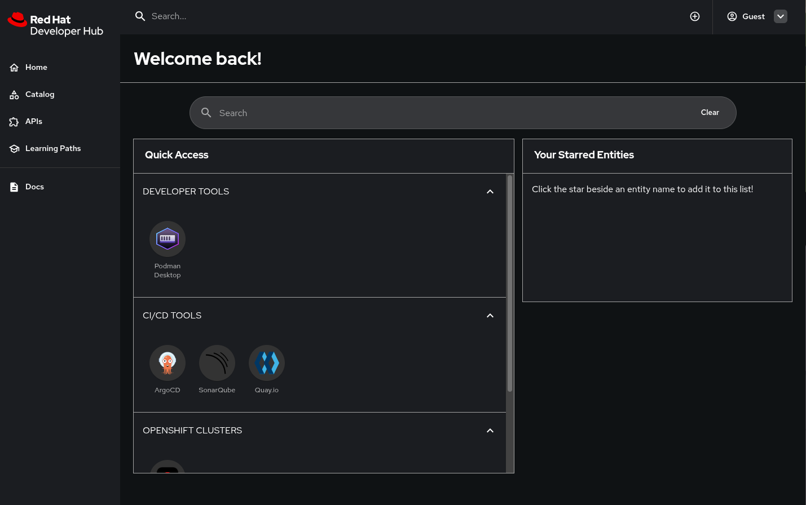

# Test locally with Red Hat Developer Hub (RHDH)

Welcome to RHDH Local - the fastest and simplest way for platform engineers to test their software catalogs, techdocs, plugins, templates, homepage customizations, configurations and more with RHDH!

RHDH Local is ideal for trying out the basic features of RHDH (like Software Catalogs or TechDocs) without the need for a Kubernetes cluster. RHDH Local is also great for testing dynamic plugins and their configuration settings. To use RHDH Local, all you really need is basic knowledge of Podman (or Docker), a PC, and a web browser. You can run it on your laptop, desktop, or on your homelab. Better still, when you're done working it's easy to remove.

>**RHDH Local is NOT a substitute for Red Hat Developer Hub**. Do not attempt to use RHDH Local as a production system. RHDH Local is designed to help individual developers test various RHDH features. It's not designed to scale and it's not suitable for use by teams (there is no RBAC for example). 

> [!CAUTION]
> There is no official, commercial support for RHDH Local. Use RHDH Local at your own risk. With all that being said, we think it's incredibly useful and any contributions you might have that could improve RHDH Local are welcome!

## What you'll need before you get started

To use RHDH Local you'll need a few things:

1. A PC based on an x86_64 (amd64) or arm64 (aarch64) architecture
2. An installation of Podman (or Docker) (with adequate resources available)
   
   - [**Podman**](https://podman.io/docs/installation) v5.4.1 or newer; [**Podman Compose**](https://github.com/containers/podman-compose) v1.3.0 or newer.
   - [**Docker Engine**](https://docs.docker.com/engine/) v28.1.0 or newer; [**Docker Compose**](https://docs.docker.com/compose/) plugin v2.24.0 or newer. This is necessary for compatibility with features such as ```env_file``` with the ```required``` key used in our compose.yaml.

   > **Note:** If you prefer to work with a graphical user interface, we recommend managing your container environments using [Podman Desktop](https://podman-desktop.io/). Podman Desktop can be [installed on a number of different systems](https://podman-desktop.io/docs/installation), and can be easier to work with if you are not as familiar with command line.
  
3. An internet connection (for downloading container images, plugins, etc.)
4. (Optional) The `git` command line client for cloning this repository (or you can download and extract the zip from GitHub)
5. (Optional) A GitHub account (if you want to integrate GitHub features into RHDH)
6. (Optional) The node `npx` tool (if you intend to build dynamic plugins in RHDH). [Node.js](https://nodejs.org/en/download) v22.16.0 or newer is recommended to build, test, and run dynamic plugins effectively. This version of Node will also install [npx](https://docs.npmjs.com/cli/v11/commands/npx), which has been packaged with [npm](https://docs.npmjs.com/cli/v11/commands/npm) since v7.0.0 and newer.
7. (Optional) A [Red Hat account](https://access.redhat.com/RegistryAuthentication#getting-a-red-hat-login-2) (if you want to use a PostgreSQL database or the commercially supported official RHDH images)

## RHDH Local - Quick Start

This method creates RHDH Local without any additional configurations or plugins. It is just the baseline to get you up and running as quickly as possible. If you wish to install any additional features, please check out the documentation for what you would specifically like to add to your RHDH Local setup.

1. Clone this repository to a location on your PC and move to the `rhdh-local` folder.

   ```sh
   git clone https://github.com/redhat-developer/rhdh-local.git && cd rhdh-local
   ```

2. ***(Optional)*** You can create a local `.env` file and override any of the default variables defined in the [`default.env`](./default.env) file provided. You can also add additional variables.
 
   In most cases, when you don't need GitHub Auth or testing different releases, you can skip this step.

3. ***(Optional)*** Create local configuration overrides.

   RHDH Local supports user-specific configuration overrides using a structured `configs/` directory. You do not need to modify default files. However, if you want to customize your setup:

   - Add your app config overrides to: `configs/app-config/app-config.local.yaml`
      > You can use the included `.example.yaml` files to get started quickly:
      >
      > ```sh
      > cp configs/app-config/app-config.local.example.yaml configs/app-config/app-config.local.yaml
      > cp configs/dynamic-plugins/dynamic-plugins.override.example.yaml configs/dynamic-plugins/dynamic-plugins.override.yaml
      > ```

   - Add your plugin config overrides to:
     `configs/dynamic-plugins/dynamic-plugins.override.yaml`
     > The override file must start with:
     > ```yaml
     > includes:
     >   - dynamic-plugins.default.yaml
     > ```
     > This ensures the base plugin list is preserved and extended, rather than replaced.

     Note: In RHDH 1.7, by default, Orchestrator plugins are integrated in the dynamic plugins. If you intend to use these
     plugins, ensure to copy the
     orchestrator dynamic plugins from `dynamic-plugins.yaml` to your `dynamic-plugins.override.yaml` version for your local
     development.

   - Add your catalog entity overrides:

      Start by copying the example files provided:

      ```sh
         cp configs/catalog-entities/users.override.example.yaml configs/catalog-entities/users.override.yaml
         cp configs/catalog-entities/components.override.example.yaml configs/catalog-entities/components.override.yaml
      ```

      Once copied, you can modify these override files to customize your catalog users or components.
      If these `.override.yaml` files are present, RHDH Local will automatically use them instead of the default `users.yaml` or `components.yaml`.

      No additional configuration is required — just drop the file in place and restart RHDH.

      You can add any extra files (like GitHub credentials) to: `configs/extra-files/`

      If present, these files will be automatically loaded by the system on startup.

      If you need features that fetch files from GitHub you should configure `integrations.github`.
      The recommended way is to use GitHub Apps. You can find hints on how to configure it in [github-app-credentials.example.yaml](configs/github-app-credentials.example.yaml) or a more detailed instruction in [Backstage documentation](https://backstage.io/docs/integrations/github/github-apps).

4. Start RHDH Local.
   This repository works with both Podman and Docker.

   **Podman**

   ```sh
   podman compose up -d
   ```

   **Docker**

   ```sh
   docker compose up -d
   ```

5. Open [http://localhost:7007](http://localhost:7007) in your browser to access RHDH. If you have not set up and enabled GitHub authentication, you will need to login as 'GUEST'.
   
   

## Cleanup

To reset RHDH Local you can use the following command. This will clean up any container attached volumes, but configuration changes made to your `rhdh-local` YAML files will remain.

```sh
podman compose down --volumes # For rhdh-local running on podman
docker compose down --volumes # For rhdh-local running on docker
```

To reset everything in the cloned `rhdh-local` repository, including any configuration changes you've made to your YAML files try:

```sh
git reset --hard
```

## Changing your configuration

When you change `app-config.local.yaml` you must restart the `rhdh` container to load RHDH your updated configuration.

```sh
podman compose stop rhdh && podman compose start rhdh
```

When you change `dynamic-plugins.yaml` you need to re-run the `install-dynamic-plugins` container and then restart RHDH instance.

```sh
podman compose run install-dynamic-plugins
podman compose stop rhdh && podman compose start rhdh
```

## Additional Configuration Guides

If you would like to change your RHDH-Local setup, or add additional features or plugins, please check out the guides below.

1. [Plugins Guide](./additional-config-guides/plugins-guide.md) - how to include your own plugins
2. [Container Image Guide](./additional-config-guides/container-image-guide.md) - how to switch to a more bleeding edge, or commercially supported version of RHDH
3. [Simulated Proxy Setup](./additional-config-guides/proxy-setup-sim.md) - testing in a simulated proxy environment
4. [PostgreSQL Guide](./additional-config-guides/postgresql-guide.md) - using PostgreSQL instead of an in-memory database
5. [Orchestrator Workflow Guide](./additional-config-guides/orchestrator-workflow-guide.md) - using Orchestrator with RHDH to develop workflows.

## Contributing and reporting issues

To report issues against this repository, please use [JIRA](https://issues.redhat.com/browse/RHIDP) with Component: **RHDH Local**

To browse the existing issues, you can use this [Query](https://issues.redhat.com/issues/?filter=-4&jql=project%20%3D%20%22Red%20Hat%20Internal%20Developer%20Platform%22%20%20AND%20component%20%3D%20%22RHDH%20Local%22%20AND%20resolution%20%3D%20Unresolved%20ORDER%20BY%20status%2C%20priority%2C%20updated%20%20%20%20DESC).

Contributions are welcome!

## License

```txt
Copyright Red Hat

Licensed under the Apache License, Version 2.0 (the "License");
you may not use this file except in compliance with the License.
You may obtain a copy of the License at

   http://www.apache.org/licenses/LICENSE-2.0

Unless required by applicable law or agreed to in writing, software
distributed under the License is distributed on an "AS IS" BASIS,
WITHOUT WARRANTIES OR CONDITIONS OF ANY KIND, either express or implied.
See the License for the specific language governing permissions and
limitations under the License.
```
