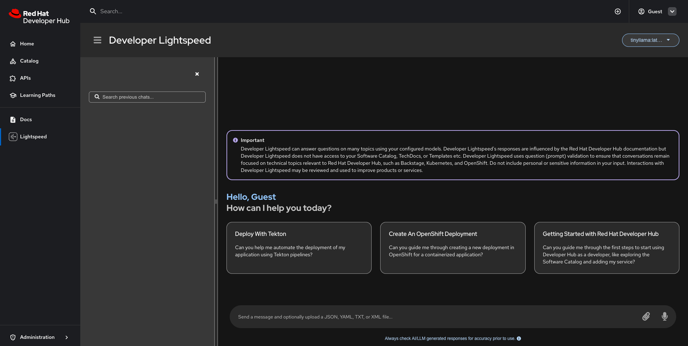

## Developer Lightspeed in RHDH local

Red Hat Developer Lightspeed (Developer Lightspeed) is a virtual assistant powered by generative AI that offers in-depth insights into Red Hat Developer Hub (RHDH), including its wide range of capabilities. You can interact with this assistant to explore and learn more about RHDH in greater detail.

Developer Lightspeed provides a natural language interface within the RHDH console, helping you easily find information about the product, understand its features, and get answers to your questions as they come up.

---

**Prerequisites**

1. A PC based on an x86_64 (amd64) or arm64 (aarch64) architecture
2. An installation of Podman (or Docker) (with adequate resources available)
   
   - [**Podman**](https://podman.io/docs/installation) v5.4.1 or newer; [**Podman Compose**](https://github.com/containers/podman-compose) v1.3.0 or newer.
   - [**Docker Engine**](https://docs.docker.com/engine/) v28.1.0 or newer; [**Docker Compose**](https://docs.docker.com/compose/) plugin v2.24.0 or newer. This is necessary for compatibility with features such as ```env_file``` with the ```required``` key used in our compose.yaml.

   > **Note:** If you prefer to work with a graphical user interface, we recommend managing your container environments using [Podman Desktop](https://podman-desktop.io/). Podman Desktop can be [installed on a number of different systems](https://podman-desktop.io/docs/installation), and can be easier to work with if you are not as familiar with command line.
---

## Getting Started

Follow these steps to configure and launch Developer Lightspeed using either `podman compose` or `docker compose`.  

**Substitute `podman compose` with `docker compose` if you are using Docker.**

---

1. **Load the Developer Lightspeed dynamic plugin**

   Copy the Lightspeed dynamic plugin overrides to **`configs/dynamic-plugins/dynamic-plugins.override.yaml`**.

   > **Warning:** This will overwrite your existing `dynamic-plugins.override.yaml` file. If you have customizations, back up or manually merge the content as needed.

   To get started quickly with Developer Lightspeed, you can copy the entire content with the following command:

   ```bash
   cp configs/dynamic-plugins/dynamic-plugins.lightspeed.override.example.yaml configs/dynamic-plugins/dynamic-plugins.override.yaml
   ```

   Alternatively, you can manually copy the content inside the `plugins` property and paste it into your existing `dynamic-plugins.override.yaml` file. If merging manually, ensure correct YAML structure and avoid duplicate keys.

2. **Copy the Lightspeed App Config example**

   Start by creating a new local app config file for Lightspeed:

   ```bash
   cp configs/app-config/app-config.lightspeed.local.example.yaml configs/app-config/app-config.lightspeed.local.yaml
   ```

   This file contains placeholder values that will be replaced using environment variables:

   ```yaml
   lightspeed:
     questionValidation: true
     servers:
       - id: ${LIGHTSPEED_SERVER_ID}
         url: ${LIGHTSPEED_SERVER_URL}
         token: ${LIGHTSPEED_SERVER_TOKEN}
   ```


   By default, the required environment variables for Lightspeed are already set in the `default.env` file:

   ```env
   LIGHTSPEED_SERVER_ID=ollama
   LIGHTSPEED_SERVER_URL=http://0.0.0.0:11434/v1
   LIGHTSPEED_SERVER_TOKEN=dummy
   ```

   You do **not** need to change these unless you want to use your own model server.  

3. **Start the application**

   You can start Developer Lightspeed in two ways, depending on your model server setup:

   #### **A. Use the default (Ollama included) setup**

   This will start all services, including the built-in Ollama model server:

   ```bash
   podman compose -f compose.yaml -f compose-with-lightspeed.yaml up -d
   # OR, if using Docker:
   docker compose -f compose.yaml -f compose-with-lightspeed.yaml up -d
   ```

   #### **B. Use your own model server (minimal setup)**

   If you want to use your own model server (such as a remote Ollama instance or another provider), use the minimal setup and set your server details in a `.env` file:

   ```bash
   podman compose -f compose.yaml -f compose-with-lightspeed-minimal.yaml up -d
   # OR, if using Docker:
   docker compose -f compose.yaml -f compose-with-lightspeed-minimal.yaml up -d
   ```

   Make sure your `.env` file in the project root contains:
   ```env
   LIGHTSPEED_SERVER_ID=your-server-id
   LIGHTSPEED_SERVER_URL=https://your.lightspeed.server/v1
   LIGHTSPEED_SERVER_TOKEN=your-api-key
   ```

---


4. **Verify that all services are running**

   After starting the application, make sure all services are running:

   ```bash
   podman compose ps
   # OR
   docker compose ps
   ```

   Look for all services to show `running` or `Up (starting)` in the Status column, like:

| CONTAINER ID | IMAGE                                                          | COMMAND                | CREATED         | STATUS                    | PORTS                                                                                                         | NAMES                  |
|--------------|----------------------------------------------------------------|------------------------|-----------------|---------------------------|---------------------------------------------------------------------------------------------------------------|------------------------|
| 31c3c681b742 | quay.io/rhdh-community/rhdh:next                               |                        | 16 seconds ago  | Exited (0) 5 seconds ago  | 8080/tcp                                                                                                      | rhdh-plugins-installer |
| 818ddf7fd045 | docker.io/ollama/ollama:latest                                 | ollama serve & ...     | 16 seconds ago  | Up 16 seconds (healthy)   | 0.0.0.0:7007->7007/tcp, 0.0.0.0:8080->8080/tcp, 0.0.0.0:11434->11434/tcp, 127.0.0.1:9229->9229/tcp            | ollama                 |
| 2860fc13b036 | quay.io/redhat-ai-dev/road-core-service:rcs-06302025-rhdh-1.6  | python3.11 runner...   | 15 seconds ago  | Up 5 seconds (starting)   | 0.0.0.0:7007->7007/tcp, 0.0.0.0:8080->8080/tcp, 0.0.0.0:11434->11434/tcp, 127.0.0.1:9229->9229/tcp, 8443/tcp  | road-core-service      |
| f7b74b9f241e | quay.io/rhdh-community/rhdh:next                               |                        | 4 seconds ago   | Up 5 seconds (starting)   | 0.0.0.0:7007->7007/tcp, 0.0.0.0:8080->8080/tcp, 0.0.0.0:11434->11434/tcp, 127.0.0.1:9229->9229/tcp            | rhdh                   |                                        |

   _Note: If any service is not running, you can inspect the logs:_

   ```bash
   podman logs <container-name>
   ```

5. **Open** http://localhost:7007/lightspeed **in your browser to access Developer Lightspeed.**

   

---


## Advanced Configuration Guides

### Running Larger Models with Ollama

Some AI models require more memory than the default Podman machine allocation. If you encounter errors such as “model requires more system memory than is available,” you can increase the memory available to your Podman virtual machine:

```bash
podman machine stop
podman machine set --memory=8192
podman machine start
```

- The example above sets the memory to **8 GiB** (`8192` MB).
- Adjust the value as needed (e.g., `--memory=16384` for 16 GiB).
- Ensure your host system has enough free RAM.

After increasing the memory, restart your containers to use the new limits.

---

### How do I change the Ollama model?

By default, the Ollama service pulls and loads the `tinyllama` model.  
To use a larger or different model, edit the `command` in your Ollama service definition in your Compose file (e.g., `compose-with-lightspeed.yaml`):

```yaml
command: >
  "ollama serve &
  sleep 5 &&
  ollama pull llama2:13b &&
  touch /tmp/ready &&
  wait"
```

- Replace `llama2:13b` with the name of the model you want to use (e.g., `mistral`, `llama2:70b`, etc.).
- Make sure the model you choose fits within your available memory.

> **Tip:** You can find available models and their memory requirements in the [Ollama model library](https://ollama.com/library).

---

### Using Your Own Ollama Models from Your System

If you have custom or pre-downloaded Ollama models on your local system, you can make them available to the Ollama container by mounting your host’s model directory into the container.

#### **Step 1: Locate Your Ollama Model Directory**

By default, Ollama stores models in:
- **Linux/macOS:** `~/.ollama`
- **Windows:** `%USERPROFILE%\.ollama`

#### **Step 2: Mount the Directory in Your Compose File**

Edit your `compose-with-lightspeed.yaml` to mount your local `.ollama` directory instead of `ollama-data` volume:

```yaml
services:
  ollama:
    image: ollama/ollama
    volumes:
      - /absolute/path/to/your/.ollama:/root/.ollama
```

- Replace `/absolute/path/to/your/.ollama` with the full path to your `.ollama` directory on your host system.
- This will make all your local models available inside the container.

**Example:**

In Linux or macOS, you might use:

```yaml
volumes:
  - /home/your-username/.ollama:/root/.ollama
```
or

```yaml
volumes:
  - /Users/your-username/.ollama:/root/.ollama
```
---

#### **Step 3: Use Your Models in the Container**

Once mounted, you can reference your model in the `ollama pull` command in the `compose-with-lightspeed.yaml`. 

Ollama will use the models from the mounted directory, so you don’t need to re-download them inside the container.

> **Tip:** If you add new models to your local `.ollama` directory, they will automatically be available in the container after a restart.

---

**This approach saves bandwidth, speeds up startup, and lets you use custom or fine-tuned models you’ve created locally.**


## Cleanup

To stop and remove the running containers:

```bash
podman compose -f compose.yaml -f compose-with-lightspeed.yaml down -v
# OR
docker compose -f compose.yaml -f compose-with-lightspeed.yaml down -v
```

---

> **Note:** All instructions in this guide apply to both Podman and Docker.  
> Replace `podman compose` with `docker compose` if you are using Docker.
