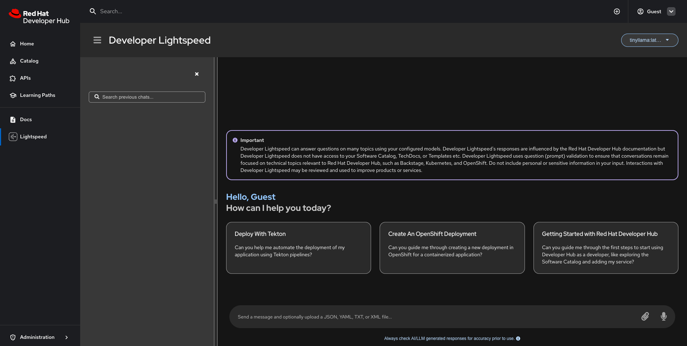

## Developer Lightspeed in RHDH local

Red Hat Developer Lightspeed (Developer Lightspeed) is a virtual assistant powered by generative AI that offers in-depth insights into Red Hat Developer Hub (RHDH), including its wide range of capabilities. You can interact with this assistant to explore and learn more about RHDH in greater detail.

Developer Lightspeed provides a natural language interface within the RHDH console, helping you easily find information about the product, understand its features, and get answers to your questions as they come up.


## Table of Contents
1. [Getting Started](#getting-started)
2. [Cleanup](#cleanup)
3. [Troubleshooting](#troubleshooting)
4. [Advanced Configuration Guides](#advanced-configuration-guides)

---

## Getting Started

Follow these steps to configure and launch Developer Lightspeed using either `podman compose` or `docker compose`.  

**Substitute `podman compose` with `docker compose` if you are using Docker.**

---

1. **Load the Developer Lightspeed dynamic plugins**

   Add the `developer-lightspeed/configs/dynamic-plugins/dynamic-plugins.lightspeed.yaml` file to the list of `includes` in your `configs/dynamic-plugins/dynamic-plugins.override.yaml` to enable developer lightspeed plugins within RHDH.
  
   Example:

   ```yaml

   includes:
   - dynamic-plugins.default.yaml
   - developer-lightspeed/configs/dynamic-plugins/dynamic-plugins.lightspeed.yaml # <-- to add to enable the developer lightspeed plugins

   # Below you can add your own custom dynamic plugins, including local ones.
   plugins: []
   ```

2. **Copy the Lightspeed App Config example**

   Start by creating a new local app config file for Lightspeed:

   ```bash
   cp developer-lightspeed/configs/app-config/app-config.lightspeed.local.example.yaml developer-lightspeed/configs/app-config/app-config.lightspeed.local.yaml
   ```

   This file contains placeholder values that will be replaced using environment variables:

   ```yaml
   lightspeed:
     questionValidation: false
     servers:
       - id: ${LIGHTSPEED_SERVER_ID}
         url: ${LIGHTSPEED_SERVER_URL}
         token: ${LIGHTSPEED_SERVER_TOKEN}
   ```


   By default, the required environment variables for Lightspeed are already set in the `default.env` file:

   ```env
   LIGHTSPEED_SERVER_ID=ollama
   LIGHTSPEED_SERVER_URL=http://0.0.0.0:11434/v1
   LIGHTSPEED_SERVER_TOKEN=dummy
   ```

   You do **not** need to change these unless you want to use your own model server.  

3. **Start the application**

   You can start Developer Lightspeed in two ways, depending on your model server setup:

   #### **A. Use the default (Ollama included) setup**

   This will start all services, including the built-in Ollama model server:

   ```bash
   podman compose -f compose.yaml -f developer-lightspeed/compose-with-ollama.yaml up -d
   # OR, if using Docker:
   docker compose -f compose.yaml -f developer-lightspeed/compose-with-ollama.yaml up -d
   ```

   ---

   #### **B. Use your own model server (minimal setup)**

   If you want to use your own model server (such as a remote Ollama instance or another provider), use the minimal setup and set your server details in a `.env` file:

   ```bash
   podman compose -f compose.yaml -f developer-lightspeed/compose.yaml up -d
   # OR, if using Docker:
   docker compose -f compose.yaml -f developer-lightspeed/compose.yaml up -d
   ```

   Make sure your `.env` file in the project root contains:
   ```env
   LIGHTSPEED_SERVER_ID=your-server-id
   LIGHTSPEED_SERVER_URL=https://your.lightspeed.server/v1
   LIGHTSPEED_SERVER_TOKEN=your-api-key
   ```

---


4. **Verify that all services are running**

   After starting the application, make sure all services are running:

   ```bash
   podman compose ps
   # OR
   docker compose ps
   ```

   Look for all services to show `running` or `Up (starting)` in the Status column, like:


   #### **A. Default setup (with Ollama):**
   You should see output similar to:

   | CONTAINER ID | IMAGE                                                          | COMMAND                | CREATED         | STATUS                    | PORTS                                                                                                         | NAMES                  |
   |--------------|----------------------------------------------------------------|------------------------|-----------------|---------------------------|---------------------------------------------------------------------------------------------------------------|------------------------|
   | 31c3c681b742 | quay.io/rhdh-community/rhdh:next                               |                        | 16 seconds ago  | Exited (0) 5 seconds ago  | 8080/tcp                                                                                                      | rhdh-plugins-installer |
   | f7b74b9f241e | quay.io/rhdh-community/rhdh:next                               |                        | 4 seconds ago   | Up 5 seconds (starting)   |  0.0.0.0:7007->7007/tcp, 127.0.0.1:9229->9229/tcp, 8080/tcp              | rhdh                   |                                        |
   | 818ddf7fd045 | docker.io/ollama/ollama:latest                                 | ollama serve & ...     | 16 seconds ago  | Up 16 seconds (healthy)   | 0.0.0.0:7007->7007/tcp, 127.0.0.1:9229->9229/tcp, 11434/tcp             | ollama                 |
   | 2860fc13b036 | quay.io/redhat-ai-dev/road-core-service:rcs-06302025-rhdh-1.6  | python3.11 runner...   | 15 seconds ago  | Up 5 seconds (starting)   | 0.0.0.0:7007->7007/tcp, 127.0.0.1:9229->9229/tcp, 8080/tcp, 8443/tcp  | road-core-service      |

   ---

   #### **B. Minimal setup (own model server, no ollama):**
   You should see output similar to:

   | CONTAINER ID | IMAGE                                                          | COMMAND                | CREATED         | STATUS                    | PORTS                                                                                                         | NAMES                  |
   |--------------|----------------------------------------------------------------|------------------------|-----------------|---------------------------|---------------------------------------------------------------------------------------------------------------|------------------------|
   | 31c3c681b742 | quay.io/rhdh-community/rhdh:next                               |                        | 16 seconds ago  | Exited (0) 5 seconds ago  | 8080/tcp                                                                                                      | rhdh-plugins-installer |
   | f7b74b9f241e | quay.io/rhdh-community/rhdh:next                               |                        | 4 seconds ago   | Up 5 seconds (starting)   |  0.0.0.0:7007->7007/tcp, 127.0.0.1:9229->9229/tcp, 8080/tcp              | rhdh                   |                                        |
   | 2860fc13b036 | quay.io/redhat-ai-dev/road-core-service:rcs-06302025-rhdh-1.6  | python3.11 runner...   | 15 seconds ago  | Up 5 seconds (starting)   | 0.0.0.0:7007->7007/tcp, 127.0.0.1:9229->9229/tcp, 8080/tcp, 8443/tcp  | road-core-service      |

   ---

   _Note: If any service is not running, you can inspect the logs:_

   ```bash
   podman logs <container-name>
   ```

5. **Open** http://localhost:7007/lightspeed **in your browser to access Developer Lightspeed.**

   

---

## Cleanup

To stop and remove the running containers:

```bash
podman compose -f compose.yaml -f compose-with-lightspeed.yaml down -v
# OR
docker compose -f compose.yaml -f compose-with-lightspeed.yaml down -v
```

---

> **Note:** All instructions in this guide apply to both Podman and Docker.  
> Replace `podman compose` with `docker compose` if you are using Docker.


## Troubleshooting

If you encounter issues while setting up or running Developer Lightspeed, try the following solutions:

### 1. Services Not Starting or Exiting Unexpectedly

- **Check container logs:**  
  Use the following command to view logs for a specific container:
  ```bash
  podman logs <container-name>
  # OR
  docker logs <container-name>
  ```
  Look for error messages that can help diagnose the problem.

- **Common causes:**
  - Port conflicts (another service is using the same port)
  - Insufficient memory or CPU resources
  - Incorrect environment variables

### 2. "model requires more system memory than is available" Error

- Increase the memory allocated to your Podman or Docker virtual machine.  
  See the [Running Larger Models with Ollama](#running-larger-models-with-ollama) section for instructions.

### 3. "Permission Denied" or File Access Errors

- Ensure you have the necessary permissions to access files and directories, especially when mounting volumes.
- On Linux/macOS, you may need to adjust permissions with `chmod` or run commands with `sudo`.

### 4. Web UI Not Accessible at http://localhost:7007/lightspeed

- Make sure all containers are running:
  ```bash
  podman compose ps
  # OR
  docker compose ps
  ```
- Check for firewall or VPN issues that may block access to localhost ports.

### 5. Environment Variables Not Set

- Double-check that your `.env` or `default.env` files are present and correctly configured.
- Restart the containers after making changes to environment files.

### 6. Still Stuck?

- Try stopping and removing all containers, then starting again:
  ```bash
  podman compose -f compose.yaml -f compose-with-lightspeed.yaml down -v
  podman compose -f compose.yaml -f compose-with-lightspeed.yaml up -d
  # OR use docker compose
  ```

If your issue persists, please [open an issue on GitHub](https://github.com/your-org/your-repo/issues) with details about your problem so we can help you troubleshoot.


## Advanced Configuration Guides

  ### Plugin Configuration Reference

  Available configuration options:

  ```yaml
  lightspeed:
    # REQUIRED: Configure LLM servers with OpenAI API compatibility
    servers:
      - id: <server_id>                    # REQUIRED: Unique identifier for the server
        url: <server_URL>                  # REQUIRED: Base URL of the LLM server (e.g., https://api.openai.com/v1)
        token: <api_key>                   # REQUIRED: Authentication token/API key for the server
    
    # OPTIONAL: Enable/disable question validation (default: true)
    # When enabled, restricts questions to RHDH-related topics for better security
    questionValidation: true
    
    # OPTIONAL: Custom users prompts displayed to users
    # If not provided, the plugin uses built-in default prompts
    prompts:
      - title: <prompt_title>              # REQUIRED: Display title for the prompt
        message: <prompt_message>          # REQUIRED: The actual prompt text/question
    
    # OPTIONAL: Backend-only configurations
    servicePort: 8080                      # OPTIONAL: Port for lightspeed service (default: 8080)
    systemPrompt: <custom_system_prompt>   # OPTIONAL: Override default RHDH system prompt
  ```

  #### Configuration Fields

  | Field | Type | Required | Default | Description |
  |-------|------|----------|---------|-------------|
  | `servers` | Array | ✅ Yes | - | Array of LLM server configurations |
  | `servers[].id` | String | ✅ Yes | - | Unique identifier for the server |
  | `servers[].url` | String | ✅ Yes | - | Base URL of the LLM server with OpenAI API compatibility |
  | `servers[].token` | String | ✅ Yes | - | Authentication token or API key for accessing the server |
  | `questionValidation` | Boolean | ❌ No | `true` | Enable/disable question validation for security |
  | `prompts` | Array | ❌ No | Built-in prompts | Custom welcome prompts for users |
  | `prompts[].title` | String | ✅ Yes* | - | Display title for the prompt (*required if prompts array is provided) |
  | `prompts[].message` | String | ✅ Yes* | - | The actual prompt text/question (*required if prompts array is provided) |
  | `servicePort` | Number | ❌ No | `8080` | Port for lightspeed backend service |
  | `systemPrompt` | String | ❌ No | RHDH default | Custom system prompt to override default behavior |

  ### Example Configurations

  #### Basic Configuration (Required fields only)
  ```yaml
  lightspeed:
    servers:
      - id: ${LIGHTSPEED_SERVER_ID}
        url: ${LIGHTSPEED_SERVER_URL}
        token: ${LIGHTSPEED_SERVER_TOKEN}
  ```

  #### Complete Configuration with All Options
  ```yaml
  lightspeed:
    servers:
      - id: ${LIGHTSPEED_SERVER_ID}
        url: ${LIGHTSPEED_SERVER_URL}
        token: ${LIGHTSPEED_SERVER_TOKEN}
    questionValidation: true
    prompts:
      - title: "Quick Start"
        message: "How do I enable a dynamic plugin?"
    servicePort: 8080
    systemPrompt: "You are a helpful assistant focused on Red Hat Developer Hub development."
  ```


### Running Larger Models with Ollama

Some AI models require more memory than the default Podman machine allocation. If you encounter errors such as “model requires more system memory than is available,” you can increase the memory available to your Podman virtual machine:

```bash
podman machine stop
podman machine set --memory=8192
podman machine start
```

- The example above sets the memory to **8 GiB** (`8192` MB).
- Adjust the value as needed (e.g., `--memory=16384` for 16 GiB).
- Ensure your host system has enough free RAM.

After increasing the memory, restart your containers to use the new limits.

---

### How do I change the Ollama model?

By default, the Ollama service pulls and loads the `tinyllama` model.  
To use a larger or different model, you can now specify the model name using the `OLLAMA_MODEL` environment variable. The Compose file supports a default value using the `${OLLAMA_MODEL:-tinyllama}` syntax.

**Example in your Compose file:**

```yaml
command: >
  "ollama serve &
  sleep 5 &&
  ollama pull ${OLLAMA_MODEL:-tinyllama} &&
  touch /tmp/ready &&
  wait"
```

- If you set `OLLAMA_MODEL` in your `.env` file or environment, that model will be used.
- If not set, it will default to `tinyllama`.
- Example `.env` entry:
  ```env
  OLLAMA_MODEL=llama2:13b
  ```
- Make sure the model you choose fits within your available memory.

> **Tip:** You can find available models and their memory requirements in the [Ollama model library](https://ollama.com/library).

---

### Using Your Own Ollama Models from Your System

If you have custom or pre-downloaded Ollama models on your local system, you can make them available to the Ollama container by mounting your host’s model directory into the container.

#### **Step 1: Locate Your Ollama Model Directory**

By default, Ollama stores models in:
- **Linux/macOS:** `~/.ollama`
- **Windows:** `%USERPROFILE%\.ollama`

#### **Step 2: Mount the Directory in Your Compose File**

You can set the path to your local `.ollama` directory using an environment variable in your `.env` file:

**In your `.env` file:**
```env
OLLAMA_MODELS_PATH=/absolute/path/to/your/.ollama
```

**In your Compose file (already set up):**
```yaml
volumes:
  - ${OLLAMA_MODELS_PATH:-ollama_data}:/root/.ollama
```

- If you set `OLLAMA_MODELS_PATH` in your `.env` file, that directory will be mounted.
- If not set, it will default to using the `ollama_data` volume.

---

#### **Step 3: Use Your Models in the Container**

Once mounted, you can reference your model in the `ollama pull` command in the `developer-lightspeed/compose-with-ollama.yaml`. 

Ollama will use the models from the mounted directory, so you don’t need to re-download them inside the container.

> **Tip:** If you add new models to your local `.ollama` directory, they will automatically be available in the container after a restart.

---

**This approach saves bandwidth, speeds up startup, and lets you use custom or fine-tuned models you’ve created locally.**


---

