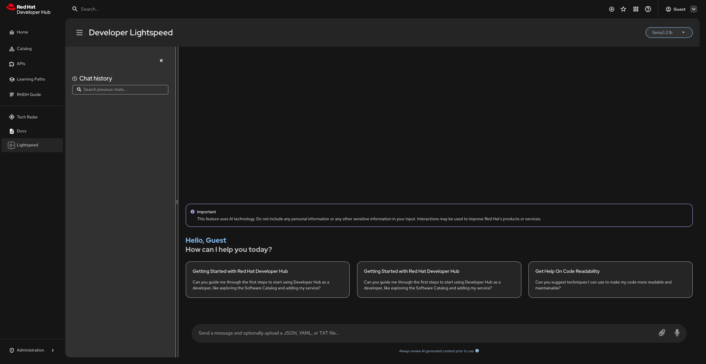

## Developer Lightspeed in RHDH local

Red Hat Developer Lightspeed (Developer Lightspeed) is a virtual assistant powered by generative AI that offers in-depth insights into Red Hat Developer Hub (RHDH), including its wide range of capabilities. You can interact with this assistant to explore and learn more about RHDH in greater detail.

Developer Lightspeed provides a natural language interface within the RHDH console, helping you easily find information about the product, understand its features, and get answers to your questions as they come up.


## Supported Architecture
Developer Lightspeed for Red Hat Developer Hub is available as a plug-in on all platforms that host RHDH, and it requires the use of Lightspeed Core.

Developer Lightspeed uses a **Bring Your Own Model (BYOM)** architecture. No inference provider is bundled by default — you must configure at least one external LLM provider. The application starts in an unconfigured state and the UI will reflect this until a provider is set up.

## Table of Contents
1. [Getting Started](#getting-started)
2. [Cleanup](#cleanup)
3. [Troubleshooting](#troubleshooting)
4. [Advanced Configuration Guides](#advanced-configuration-guides)
5. [Maintainers](#maintainers)

---

## Getting Started

> [!IMPORTANT]
> Developer Lightspeed starts in an **unconfigured state** with no inference provider. You must configure at least one external LLM provider before you can use the chatbot. The UI will reflect the unconfigured state until a provider is set up.

Follow these steps to configure and launch Developer Lightspeed.

---

1. **Load the Developer Lightspeed dynamic plugins**

   Add the `developer-lightspeed/configs/dynamic-plugins/dynamic-plugins.lightspeed.yaml` file to the list of `includes` in your `configs/dynamic-plugins/dynamic-plugins.override.yaml` to enable Developer Lightspeed plugins within RHDH.
  
   Example:

   ```yaml

   includes:
   - dynamic-plugins.default.yaml
   - developer-lightspeed/configs/dynamic-plugins/dynamic-plugins.lightspeed.yaml # <-- to add to enable the developer lightspeed plugins

   # Below you can add your own custom dynamic plugins, including local ones.
   plugins: []
   ```

2. **Copy the Lightspeed App Config example**

   Start by creating a new local app config file for Lightspeed:

   ```bash
   cp developer-lightspeed/configs/app-config/app-config.lightspeed.local.example.yaml developer-lightspeed/configs/app-config/app-config.lightspeed.local.yaml
   ```

3. **Set Environment Variables**

    > [!NOTE]
    > If you intend to use any environment variables in the Lightspeed Core configuration file, [lightspeed-stack.yaml](./configs/extra-files/lightspeed-stack.yaml), it is important to note that Lightspeed Core parses environment variables differently than what is typical. Environment variables for this file must be in the form:
    >
    > `${env.VAR}`
    >
    > `${env.VAR:=default-value}`
    >
    > `${env.VAR:+value}`

    In the root of this repository there is a `default.env` file. Copy its contents to `.env` and fill in the required values:

    ```bash
    cp default.env .env
    ```

    > [!IMPORTANT]
    > You **must** configure at least one inference provider in your `.env` file before starting the application. Without a configured provider, Lightspeed will start in an unconfigured state and the chatbot will not be functional.

    ---

    ### Configure an Inference Provider

    Developer Lightspeed supports any service that is **OpenAI API compatible**. Configure **at least one** of the following providers in your `.env` file. You can enable multiple providers simultaneously.

    > [!NOTE]
    > **Supported Providers:**
    > Developer Lightspeed supports any service that is **OpenAI API compatible**, including but not limited to:
    > - **vLLM**: A high-performance inference server (self-hosted or cloud)
    > - **OpenAI**: OpenAI's API (GPT-4, etc.)
    > - **Ollama**: A locally or remotely hosted Ollama instance
    > - **Vertex AI**: Google Cloud's Vertex AI service (experimental)
    >

    #### **Option A: vLLM Provider (or Any OpenAI API Compatible Endpoint)**

    Use vLLM for high-performance inference with self-hosted or cloud-based vLLM servers. **This provider configuration also works with any OpenAI API compatible service** (Azure OpenAI, LM Studio, Mistral, Nvidia NIM, etc.) that provides an OpenAI-compatible endpoint.

    ```env
    # Enable vLLM provider (or generic OpenAI API compatible endpoint)
    ENABLE_VLLM=true
    
    # REQUIRED: URL to your server (must end with /v1)
    # Examples:
    #   - vLLM server: https://your-vllm-server.com/v1
    #   - Azure OpenAI: https://your-resource.openai.azure.com/v1
    #   - LM Studio: http://localhost:1234/v1
    #   - Any OpenAI-compatible endpoint
    VLLM_URL=https://your-server.com/v1
    
    # REQUIRED: API key for authentication (if your server requires it)
    # For Azure OpenAI, use your Azure API key
    # For LM Studio or local servers, you can use any value or leave as default
    VLLM_API_KEY=your-api-key-here
    
    # OPTIONAL: Maximum tokens per request (default: 4096)
    # VLLM_MAX_TOKENS=4096
    
    # OPTIONAL: TLS verification (default: true)
    # Set to false for local servers with self-signed certificates
    # VLLM_TLS_VERIFY=true
    ```

    > [!TIP]
    > **Using Other OpenAI API Compatible Services:**
    > 
    > If you have an OpenAI API compatible endpoint that doesn't have its own provider configuration (like Azure OpenAI, LM Studio, Mistral, Nvidia NIM, etc.), you can use the **vLLM provider configuration** above. Simply:
    > 1. Set `ENABLE_VLLM=true`
    > 2. Set `VLLM_URL` to your service's endpoint (must end with `/v1`)
    > 3. Set `VLLM_API_KEY` to your service's API key (if required)
    > 
    > The `remote::vllm` provider type accepts any OpenAI API compatible endpoint, not just vLLM servers.

    #### **Option B: OpenAI Provider**

    Use OpenAI's API to access GPT models (GPT-4, etc.).

    ```env
    # Enable OpenAI provider
    ENABLE_OPENAI=true
    
    # REQUIRED: Your OpenAI API key
    OPENAI_API_KEY=sk-your-openai-api-key-here
    ```

    #### **Option C: Ollama Provider**

    Use an externally hosted Ollama instance to serve models. You must run your own Ollama server separately — it is not bundled in the compose setup.

    ```env
    # Enable Ollama provider
    ENABLE_OLLAMA=true
    
    # REQUIRED: URL to your Ollama server (must end with /v1)
    # Examples:
    #   - Local Ollama: http://host.docker.internal:11434/v1
    #   - Remote Ollama: https://your-ollama-server.com:11434/v1
    OLLAMA_URL=http://host.docker.internal:11434/v1
    ```

    > [!NOTE]
    > Since Ollama runs outside the compose stack, you need to ensure the URL is accessible from within the containers. For a locally running Ollama, use `host.docker.internal` (Docker) or `host.containers.internal` (Podman) instead of `localhost`.

    #### **Option D: Vertex AI Provider (Experimental)**

    Use Google Cloud's Vertex AI service to run Gemini models.

    > [!WARNING]
    > **Experimental Feature:** Using Vertex AI to run Google models is experimental. Vertex AI provides an OpenAI-compatible API for Gemini models, which is why it can work with Developer Lightspeed (which supports OpenAI API implementations). This is provided as an alternative way to access Google models since `remote:gemini` is not yet fully supported.

    ```env
    # Enable Vertex AI provider
    ENABLE_VERTEX_AI=true
    
    # REQUIRED: Absolute path to your Google Cloud credentials JSON file
    VERTEX_AI_CREDENTIALS_PATH=/absolute/path/to/your/google-cloud-credentials.json
    
    # REQUIRED: Your GCP project ID
    VERTEX_AI_PROJECT=your-gcp-project-id
    
    # OPTIONAL: GCP location/region (default: us-central1)
    # VERTEX_AI_LOCATION=us-central1
    ```

    > [!NOTE]
    > **To use Vertex AI, you need:**
    > 1. A Google Cloud Platform (GCP) project with Vertex AI API enabled
    > 2. A service account with appropriate permissions
    > 3. A service account key file (JSON) downloaded from GCP
    > 4. Set `VERTEX_AI_PROJECT` to your project ID
    > 5. Set `VERTEX_AI_CREDENTIALS_PATH` to the absolute path of your credentials JSON file

    ---

    ### Query Validation Configuration (Optional)

    Developer Lightspeed supports query validation, which restricts the chatbot to RHDH-related questions. When enabled, off-topic queries (e.g., asking about the weather) will be rejected while development-related questions are allowed.

    ```env
    # Enable query validation
    ENABLE_VALIDATION=true
    
    # REQUIRED if validation is enabled: Must be one of your enabled providers
    # Example: if ENABLE_OPENAI=true, then set VALIDATION_PROVIDER=openai
    VALIDATION_PROVIDER=openai
    
    # REQUIRED if validation is enabled: Must be an available model for the chosen provider
    # Example: VALIDATION_MODEL_NAME=gpt-4o-mini
    VALIDATION_MODEL_NAME=gpt-4o-mini
    ```

    > [!NOTE]
    > The validation provider must be one of your enabled inference providers, and the model must be available on that provider.

4. **Start the application**

   To start Developer Lightspeed, run the following from the root of the repository:

   ```bash
   bash ./developer-lightspeed/scripts/start-lightspeed.sh
   ```

   The script will auto-detect your container runtime (podman or docker) and start the services. If auto-detection fails, it will prompt you to choose manually.

   > [!IMPORTANT]
   > Ensure you have configured at least one inference provider in your `.env` file (see step 3 above) before starting. Without a provider, the chatbot will not be functional.


---


5. **Verify that all services are running**

   After starting the application, make sure all services are running:

   ```bash
   podman compose ps
   # OR
   docker compose ps
   ```

   Look for all services to show `running` or `Up` in the Status column. You should see output similar to:

   | CONTAINER ID | IMAGE | CREATED | STATUS | NAMES |
   |--------------|-------|---------|--------|-------|
   | 31c3c681b742 | quay.io/rhdh-community/rhdh:next | 16 seconds ago | Exited (0) 5 seconds ago | rhdh-plugins-installer |
   | f7b74b9f241e | quay.io/rhdh-community/rhdh:next | 4 seconds ago | Up 5 seconds (starting) | rhdh |
   | a4e2b1f38d90 | quay.io/redhat-ai-dev/rag-content:release-1.9-... | 16 seconds ago | Exited (0) 10 seconds ago | rag-init |
   | 2860fc13b036 | quay.io/lightspeed-core/lightspeed-stack:0.5.1 | 15 seconds ago | Up 5 seconds (starting) | lightspeed-core |

   - `rhdh-plugins-installer` and `rag-init` are init containers — they run once and exit with status `0`.
   - `rhdh` and `lightspeed-core` should show `Up` or `running`.

   _Note: If any service is not running, you can inspect the logs:_

   ```bash
   podman logs <container-name>
   ```

6. **Open** http://localhost:7007/lightspeed **in your browser to access Developer Lightspeed.**

   

---

## Cleanup

### Quick Cleanup (Recommended)

The easiest way to stop Developer Lightspeed is using the stop script:

```bash
bash ./developer-lightspeed/scripts/stop-lightspeed.sh
```

**With volumes removal:**
```bash
bash ./developer-lightspeed/scripts/stop-lightspeed.sh -v
# or
bash ./developer-lightspeed/scripts/stop-lightspeed.sh --volumes
```

The script will:
- Auto-detect your container runtime (podman or docker)
- **Without `-v` flag**: Stop containers only (preserves volumes for faster restart)
- **With `-v` flag**: Stop containers and remove volumes (complete cleanup)

### Manual Cleanup

If you prefer to stop containers manually:

**Stop containers only (preserves volumes):**
```bash
podman compose -f compose.yaml -f developer-lightspeed/compose.yaml down
```

**Stop containers and remove volumes:**
```bash
podman compose -f compose.yaml -f developer-lightspeed/compose.yaml down -v
```

> **Note:** All instructions in this guide apply to both Podman and Docker.  
> Replace `podman compose` with `docker compose` if you are using Docker.


## Troubleshooting

If you encounter issues while setting up or running Developer Lightspeed, try the following solutions:

### 1. Services Not Starting or Exiting Unexpectedly

- **Check container logs:**  
  Use the following command to view logs for a specific container:
  ```bash
  podman logs <container-name>
  # OR
  docker logs <container-name>
  ```
  Look for error messages that can help diagnose the problem.

- **Common causes:**
  - Port conflicts (another service is using the same port)
  - Insufficient memory or CPU resources
  - Incorrect environment variables
  - Missing synced config files (run `sync-lightspeed-configs.sh` — see [Syncing Lightspeed Configuration Files](#syncing-lightspeed-configuration-files))

### 2. "Permission Denied" or File Access Errors

- Ensure you have the necessary permissions to access files and directories, especially when mounting volumes.
- On Linux/macOS, you may need to adjust permissions with `chmod` or run commands with `sudo`.

### 3. Web UI Not Accessible at http://localhost:7007/lightspeed

- Make sure all containers are running:
  ```bash
  podman compose ps
  # OR
  docker compose ps
  ```
- Check for firewall or VPN issues that may block access to localhost ports.

### 4. Chatbot Shows Unconfigured State

- Developer Lightspeed starts unconfigured by default. You must configure at least one inference provider in your `.env` file (see step 3).
- **Verify provider is enabled**: Check that at least one of `ENABLE_VLLM=true`, `ENABLE_OPENAI=true`, `ENABLE_OLLAMA=true`, or `ENABLE_VERTEX_AI=true` is set in your `.env` file.
- **Check required variables**: Ensure all required variables for your chosen provider are set.
- **Verify connectivity**: Ensure the provider URL is accessible from within the container.
- **Check logs**: Review `lightspeed-core` container logs for provider connection errors:
  ```bash
  podman logs lightspeed-core
  # OR
  docker logs lightspeed-core
  ```
- **Validate API keys**: Ensure API keys are correct and have proper permissions.

### 5. Environment Variables Not Set

- Double-check that your `.env` file is present and correctly configured.
- Restart the containers after making changes to environment files.

### 6. Query Validation Not Working

If you enabled query validation but it isn't filtering queries:

- **Verify validation is enabled**: Check that `ENABLE_VALIDATION=true` is set in your `.env` file.
- **Check provider**: Ensure `VALIDATION_PROVIDER` is set to one of your enabled inference providers.
- **Check model**: Ensure `VALIDATION_MODEL_NAME` is set to a model available on the validation provider.

### 7. Still Stuck?

- Try stopping and removing all containers, then starting again — see [Cleanup](#cleanup).

If your issue persists, please [open an issue on GitHub](https://github.com/redhat-developer/rhdh-local/issues) with details about your problem so we can help you troubleshoot.


## Advanced Configuration Guides

### Plugin Configuration Reference

Available configuration options:

```yaml
lightspeed:
  # OPTIONAL: Custom users prompts displayed to users
  # If not provided, the plugin uses built-in default prompts
  prompts:
    - title: <prompt_title>              # REQUIRED: Display title for the prompt
      message: <prompt_message>          # REQUIRED: The actual prompt text/question
  
  # OPTIONAL: Backend-only configurations
  servicePort: 8080                      # OPTIONAL: Port for lightspeed service (default: 8080)
  systemPrompt: <custom_system_prompt>   # OPTIONAL: Override default RHDH system prompt
```

#### Configuration Fields

| Field | Type | Required | Default | Description |
|-------|------|----------|---------|-------------|
| `prompts` | Array | No | Built-in prompts | Custom welcome prompts for users |
| `prompts[].title` | String | Yes* | - | Display title for the prompt (*required if prompts array is provided) |
| `prompts[].message` | String | Yes* | - | The actual prompt text/question (*required if prompts array is provided) |
| `servicePort` | Number | No | `8080` | Port for lightspeed backend service |
| `systemPrompt` | String | No | RHDH default | Custom system prompt to override default behavior |

### Example Configuration

```yaml
lightspeed:
  prompts:
    - title: "Quick Start"
      message: "How do I enable a dynamic plugin?"
  servicePort: 8080
  systemPrompt: "You are a helpful assistant focused on Red Hat Developer Hub development."
```

---

### Overriding the Lightspeed Core Image

By default, the compose setup uses `quay.io/lightspeed-core/lightspeed-stack:0.5.1`. To use a different image (e.g., a newer version or a custom build), set the `LIGHTSPEED_CORE_IMAGE` environment variable in your `.env` file:

```env
LIGHTSPEED_CORE_IMAGE=quay.io/lightspeed-core/lightspeed-stack:0.6.0
```

---

### Increasing Container Runtime Memory

If you encounter out-of-memory issues with the Lightspeed Core container, you can increase the memory available to your Podman or Docker virtual machine:

```bash
podman machine stop
podman machine set --memory=8192
podman machine start
```

- The example above sets the memory to **8 GiB** (`8192` MB).
- Adjust the value as needed (e.g., `--memory=16384` for 16 GiB).
- Ensure your host system has enough free RAM.

After increasing the memory, restart your containers to use the new limits.

---

## Maintainers

### Syncing Lightspeed Configuration Files

The Lightspeed Core configuration files (`config.yaml`, `rhdh-profile.py`, `lightspeed-stack.yaml`) are maintained upstream in the [redhat-ai-dev/lightspeed-configs](https://github.com/redhat-ai-dev/lightspeed-configs) repository. The sync script downloads them into `developer-lightspeed/configs/extra-files/`.

**Sync from default (main branch):**
```bash
bash ./developer-lightspeed/scripts/sync-lightspeed-configs.sh
```

**Sync from a specific ref:**
```bash
bash ./developer-lightspeed/scripts/sync-lightspeed-configs.sh --ref v1.0.0
```

**Sync from a different repository:**
```bash
bash ./developer-lightspeed/scripts/sync-lightspeed-configs.sh --repo your-org/your-fork
```

**Check if local files are up to date (dry run):**
```bash
bash ./developer-lightspeed/scripts/sync-lightspeed-configs.sh --check
```

---
