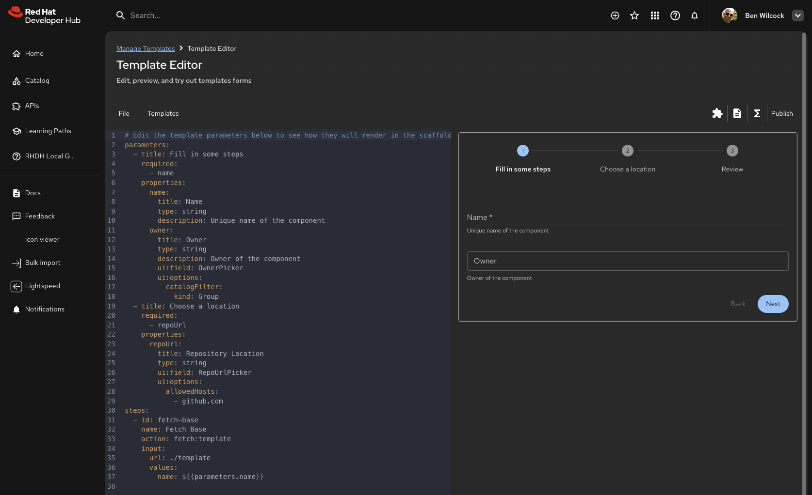

This guide is for platform engineers and template authors who want to create Software Templates for their organization. If you're looking to use existing templates, see the [Understanding & Using Templates](templates.md) guide.

Creating your own templates allows you to codify your organization's best practices and make them available to all developers. Templates are written in YAML and define the parameters (inputs) and steps (actions) that the template will execute.

!!! important "Customize Templates for Your Organization"
    While using templates from the [Red Hat Developer Hub Software Templates library](https://github.com/redhat-developer/red-hat-developer-hub-software-templates) or other online sources is a great starting point, remember: **it can't be your organization's golden path if another organization wrote it.** Best practice is to *always* modify, test, and maintain templates to ensure they align with your security policies, compliance requirements, naming conventions, and organizational standards before making them available to your developers.

## Template Structure

A basic template has this structure:

```yaml
apiVersion: scaffolder.backstage.io/v1beta3
kind: Template
metadata:
  name: my-template
  title: My Template
  description: Creates a new project following our standards
spec:
  owner: platform-engineering
  type: service
  parameters:
    - title: Basic Information
      required:
        - name
      properties:
        name:
          title: Name
          type: string
          description: Unique name for the component
  steps:
    - id: generate
      name: Generate Code
      action: fetch:template
      input:
        url: ./skeleton
        values:
          name: ${{ parameters.name }}
```

## Key Components

**Metadata**

The `metadata` section identifies your template:
* `name` - Unique identifier for the template
* `title` - Display name shown to users
* `description` - What the template does (appears on the template card)

**Spec**

The `spec` section defines the template's behavior:
* `owner` - Who owns/maintains this template
* `type` - Category (service, website, library, etc.)
* `parameters` - The form fields users will fill out
* `steps` - The actions the template will execute

**Parameters**

Parameters define what information the template needs from users. Each parameter can specify:
* Field type (string, number, boolean, etc.)
* Validation rules (patterns, required fields, min/max values) - See [Backstage Input Examples](https://backstage.io/docs/features/software-templates/input-examples/) for detailed validation options
* UI enhancements (custom field types, autofocus, placeholders)
* Default values

**Steps**

Steps are the actions the template performs. Common built-in actions include:
* `fetch:template` - Generate code from a skeleton template
* `publish:github` - Create a GitHub repository
* `publish:gitlab` - Create a GitLab repository
* `catalog:register` - Register the component in the Software Catalog
* Custom actions from plugins (e.g., `quay:create-repository`, `github:pull-request`)

!!! tip "Start Simple"

    Begin with a simple template that does one thing well. You can always add more steps and complexity later as you learn what works best for your organization.

!!! tip "Discover Available Actions"
    Visit the [`/create/actions`](/create/actions) page in your Developer Hub instance to see all available actions and their required inputs. This helps you understand what's possible when writing templates.

!!! warning "Action ID Naming"
    When creating custom scaffolder actions, **always use camelCase for action IDs** instead of kebab-case. Action IDs with dashes (like `fetch-component-id`) will cause template expressions like `${{ steps.fetch-component-id.output.componentId }}` to return `NaN` because the dashes are evaluated as subtraction operators in JavaScript expressions.

!!! tip "Learn from Examples"

    Don't start from scratch! The [Red Hat Developer Hub Software Templates library](https://github.com/redhat-developer/red-hat-developer-hub-software-templates) contains dozens of example templates you can copy and customize. Browse the repository to find templates similar to what you want to create, then use them as a starting point for your own templates.

## Template Skeleton

When using the `fetch:template` action, you provide a "skeleton" directory containing template files. The scaffolder processes these files using [Nunjucks templating](https://mozilla.github.io/nunjucks/), allowing you to inject values and use conditional logic.

For example, a skeleton `package.json` might look like:

```json
{
  "name": "{{ values.name }}",
  "description": "{{ values.description }}",
  "version": "1.0.0"
}
```

The `{{ values.name }}` syntax will be replaced with the actual value when the template runs.

!!! info "Built In Template Editor"

    Red Hat Developer Hub includes a built in Template Editor that lets you experiment with templates without committing changes. Access the template editor at [/create/edit](/create/edit) to test your template syntax and see how forms render before adding templates to your repository.

    

    Notice how the built-in template editor only uses the `parameters:` section onwards. It doesn't use the whole template stanza.

## Adding new templates to the software catalog

Templates are catalog entities, just like components and APIs. To make a template available in your Red Hat Developer Hub instance, you need to register it in the Software Catalog.

### Method 1: Using a Template Repository (Recommended)

The best practice is to create a central source-code repository for all your templates. This makes management easier and allows all your templates to be automatically discovered by Developer Hub (once registered).

**Repository Structure**

```
templates-repository/
├─ location.yaml
├─ nodejs-service/
│  ├─ template.yaml
│  ├─ README.md
│  └─ skeleton/
├─ react-app/
│  ├─ template.yaml
│  └─ skeleton/
└─ java-microservice/
   ├─ template.yaml
   └─ skeleton/
```

**Location File**

Create a `location.yaml` at the root that uses glob patterns to import all templates:

```yaml
apiVersion: backstage.io/v1alpha1
kind: Location
metadata:
  name: templates
  description: All software templates
spec:
  targets:
    - './*/template.yaml'
```

**Register the Location**

Add the location to the `app-config.yaml` of your RHDH instance so that the templates are added automatically at boot time:

```yaml
catalog:
  locations:
    - type: url
      target: https://github.com/your-org/templates/blob/main/location.yaml
      rules:
        - allow: [Template]
```

Once registered, any new templates you add to the repository will automatically appear in your Developer Hub instance within a few minutes.

### Method 2: Registering Individual Templates

If you only need to register a single template or a few templates (rather than an entire repository), you can point directly to individual `template.yaml` files in your `app-config.yaml`:

```yaml
catalog:
  locations:
    - type: url
      target: https://github.com/your-org/templates/blob/main/my-template/template.yaml
      rules:
        - allow: [Template]
```

!!! note "Method 1 vs Method 2"
    Both methods use the same `type: url` syntax in `app-config.yaml`. The key difference is:
    
    * **Method 1** points to a `location.yaml` file that automatically discovers multiple templates using glob patterns (e.g., `./*/template.yaml`). This is more scalable when you have many templates.
    
    * **Method 2** points directly to individual `template.yaml` files. You need one entry per template. Use this when you only have a few templates or want to register templates from different repositories.

!!! tip "Alternative: Catalog Import UI"
    You can also register templates interactively using the [`/catalog-import`](/catalog-import) feature. Enter the URL of the template you wish to import (e.g., `https://github.com/your-org/templates/blob/main/my-template/template.yaml`) in the import textbox. The template will be analyzed and, once validated, added to the software catalog (if your permissions allow).

### Method 3: Local File Registration

For local development or testing, you can register templates from local files:

```yaml
catalog:
  locations:
    - type: file
      target: /path/to/template.yaml
      rules:
        - allow: [Template]
```

!!! success "Automatic Discovery"

    Once a template location is registered, Backstage automatically discovers and imports templates. New templates appear in the Software Templates page without requiring manual registration of each individual template.

## Basic templates reference with key syntax and samples

This section provides a quick reference for common template patterns and syntax.

### Parameter Types

??? example "String with Validation"
    ```yaml
    properties:
      name:
        title: Component Name
        type: string
        description: Unique name for the component
        pattern: '^[a-z][a-z0-9-]*$'
        maxLength: 50
        ui:autofocus: true
    ```

??? example "Entity Picker"
    ```yaml
    properties:
      owner:
        title: Owner
        type: string
        description: Team or user that owns this component
        ui:field: OwnerPicker
        ui:options:
          allowedKinds: [Group, User]
    ```

??? example "Secret Field"
    ```yaml
    properties:
      token:
        title: API Token
        type: string
        ui:field: Secret
        description: Authentication token (will be masked)
    ```

??? example "Select/Dropdown"
    ```yaml
    properties:
      framework:
        title: Framework
        type: string
        enum: [react, vue, angular]
        enumNames: [React, Vue.js, Angular]
        description: Choose your frontend framework
    ```

### Common Actions

??? example "Fetch Template"
    ```yaml
    - id: generate
      name: Generate Code
      action: fetch:template
      input:
        url: ./skeleton
        targetPath: ./source
        values:
          name: ${{ parameters.name }}
          owner: ${{ parameters.owner }}
    ```
    
    The `url` can be a relative path (like `./skeleton`) if the skeleton is in the same repository as the template, or a full URL to a Git repository containing the skeleton code.

??? example "Publish to GitHub"
    ```yaml
    - id: publish
      name: Create GitHub Repository
      action: publish:github
      input:
        allowedHosts: ['github.com']
        description: ${{ parameters.description }}
        repoUrl: github.com?owner=${{ parameters.owner }}&repo=${{ parameters.name }}
        defaultBranch: main
        sourcePath: ./source
    ```

    The `repoUrl` parameter uses the format `github.com?owner=<owner>&repo=<repo-name>`. For GitLab, use `gitlab.com?owner=<owner>&repo=<repo-name>`.

??? example "Register in Catalog"
    ```yaml
    - id: register
      name: Register Component
      action: catalog:register
      input:
        repoContentsUrl: ${{ steps.publish.output.remoteUrl }}
        catalogInfoPath: '/catalog-info.yaml'
    ```
    
    The `catalog:register` action registers a component in the Software Catalog. The component must have a `catalog-info.yaml` file at the specified `catalogInfoPath`. Alternatively, components are automatically discovered when repositories containing `catalog-info.yaml` files are added to catalog locations.

### Using Template Filters

Template filters allow you to process and transform values:

??? example "Extract Name from Entity Reference"
    ```yaml
    title: "Update for ${{ parameters.component | parseEntityRef | prop('name') }}"
    ```

??? example "Convert to Lowercase"
    ```yaml
    repoName: ${{ parameters.name | lower }}
    ```

??? example "Extract Namespace"
    ```yaml
    namespace: ${{ parameters.owner | parseEntityRef | prop('namespace') }}
    ```

### Output Links

Templates can provide links to created resources:

??? example "Output Links Example"
    ```yaml
    output:
      links:
        - title: View Repository
          url: ${{ steps.publish.output.remoteUrl }}
        - title: Open Pull Request
          url: ${{ steps.pr.output.pullRequestUrl }}
        - title: View in Catalog
          icon: catalog
          entityRef: ${{ steps.register.output.entityRef }}
    ```
    
    Output links can use `url` for external links or `entityRef` for links to catalog entities. The `icon` property is optional and can be used to specify an icon for the link.

### Complete Example

Here's a complete example template that - with the right `./source` code skeleton - could be used to scaffold a Node.js service:

!!! note "Template Validation"
    If you encounter validation errors in the template editor, ensure that:

    * The `parameters` field is an array (starts with `-`)
    * All indentation is consistent (use spaces, not tabs)
    * All required fields are present for each step

```yaml
apiVersion: scaffolder.backstage.io/v1beta3
kind: Template
metadata:
  name: nodejs-service
  title: Node.js Microservice
  description: Creates a Node.js microservice with CI/CD
  tags:
    - nodejs
    - microservice
spec:
  owner: platform-engineering
  type: service
  ## <------ To test this sample in the editor, copy `parameters:` onwards! --------->
  parameters:
    - title: Basic Information
      required:
        - name
        - owner
      properties:
        name:
          title: Service Name
          type: string
          description: Unique name for the service
          pattern: '^[a-z][a-z0-9-]*$'
          ui:autofocus: true
        owner:
          title: Owner
          type: string
          ui:field: OwnerPicker
          description: Team or user that owns this service
        description:
          title: Description
          type: string
          description: What does this service do?
  steps:
    - id: generate
      name: Generate Service Code
      action: fetch:template
      input:
        url: ./skeleton
        targetPath: ./source
        values:
          name: ${{ parameters.name }}
          owner: ${{ parameters.owner }}
          description: ${{ parameters.description }}
    - id: publish
      name: Create GitHub Repository
      action: publish:github
      input:
        allowedHosts: ['github.com']
        description: ${{ parameters.description }}
        repoUrl: github.com?owner=${{ parameters.owner }}&repo=${{ parameters.name }}
        defaultBranch: main
        sourcePath: ./source
    - id: register
      name: Register in Catalog
      action: catalog:register
      input:
        repoContentsUrl: ${{ steps.publish.output.remoteUrl }}
        catalogInfoPath: '/catalog-info.yaml'
  output:
    links:
      - title: Repository
        url: ${{ steps.publish.output.remoteUrl }}
      - title: View in Catalog
        icon: catalog
        entityRef: ${{ steps.register.output.entityRef }}
```

## Learning more (online links and sources)

This guide provides an introduction to creating Software Templates, but there's much more to learn. Here are resources to help you dive deeper:

### Official Documentation

* [Red Hat Developer Hub - Customizing Templates](https://docs.redhat.com/en/documentation/red_hat_developer_hub/1.8/html-single/customizing_red_hat_developer_hub/index) - Official Red Hat documentation on customizing templates
* [Backstage Software Templates Guide](https://backstage.io/docs/features/software-templates/writing-templates/) - Comprehensive guide to writing templates
* [Backstage Template Writing Reference](https://backstage.io/docs/features/software-templates/writing-templates/) - Detailed syntax and API reference

### Template Examples

!!! success "Red Hat Developer Hub Template Library 🎯"

    The [Red Hat Developer Hub Software Templates](https://github.com/redhat-developer/red-hat-developer-hub-software-templates) repository contains a comprehensive collection of example templates covering a wide range of technologies and use cases. You can browse these templates, copy them, and customize them to fit your organization's needs. Templates include examples for:
    
    * AI/ML applications (chatbot, RAG, audio transcription, coding)
    * Backend services (Node.js, Quarkus, Spring Boot, Go, Python)
    * Frontend applications (.NET, React, Angular)
    * CI/CD pipelines (Tekton, GitHub Actions)
    * Infrastructure (ArgoCD, Ansible, Helm)
    * Plugins and extensions
    * And many more!
    
    These Red Hat templates serve as excellent starting points and demonstrate best practices for template structure, parameter definitions, and action usage. Also available are the official [Backstage Software Templates](https://github.com/backstage/software-templates) - be sure to check these out too!

### Advanced Topics

Once you're comfortable with the basics of creating templates, explore these advanced topics to enhance your templates with custom functionality and sophisticated features:

* [Custom Field Extensions](https://backstage.io/docs/features/software-templates/writing-custom-field-extensions/) - Create custom form fields for templates
* [Template Filters](https://backstage.io/docs/features/software-templates/template-extensions) - Process and transform template values
* [Nunjucks Templating](https://mozilla.github.io/nunjucks/templating.html) - Template syntax reference for skeleton files
* [Ten Template Tips](ten_template_tips.md) - Advanced tips and best practices for creating better templates

### Related Features

Templates work closely with other Red Hat Developer Hub features. Understanding these related features will help you create more powerful and integrated templates:

* [Understanding & Using the Software Catalog](software-catalog.md) - Learn how templates create catalog entities
* [Understanding & Using TechDocs](techdocs.md) - Document your templates with TechDocs
* [RHDH Extensions Catalog](https://catalog.redhat.com/extensions) - Find plugins that add new scaffolder actions

!!! success "Start Creating Templates"

    The best way to learn templates is by creating them! Start with a simple template for a common task in your organization, then gradually add more features as you become comfortable with the syntax and capabilities.

*[RHDH]: Red Hat Developer Hub

