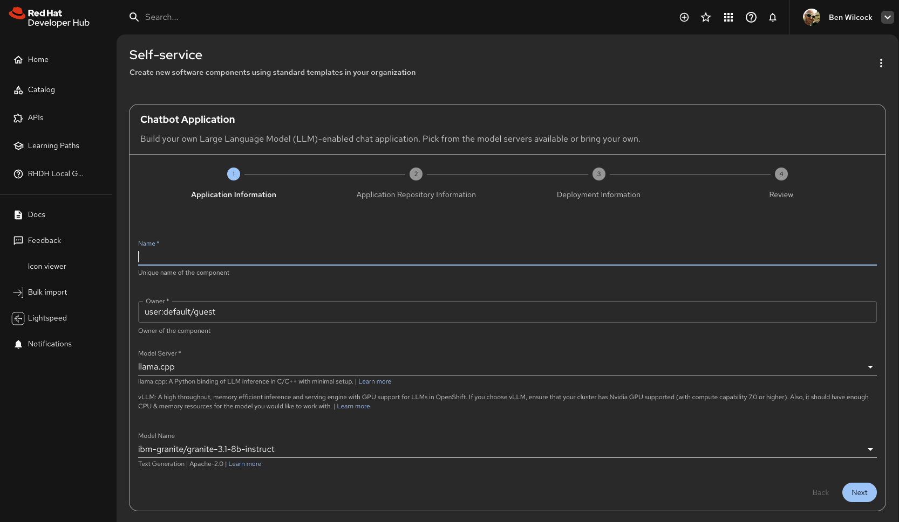

Software Templates are one of the most powerful features in Red Hat Developer Hub. They transform your developer portal into a self-service productivity powerhouse, enabling developers to create new projects, services, and components with just a few clicks—all while following your organization's best practices automatically.

## What are Templates and why are they useful?

**Software Templates** are predefined workflows that automate the creation of new software components, services, and projects. Think of them as "recipes" that platform engineers create to standardize how developers bootstrap new applications, ensuring consistency, security, and adherence to organizational standards.

Instead of manually creating repositories, setting up CI/CD pipelines, configuring deployment targets, and writing boilerplate code, developers can use a template to do all of this automatically. The template guides them through a simple form, collects the necessary information, and then executes a series of actions to create everything they need.

!!! success "Self-Service Development 🚀"

    Templates enable true developer self-service. No more waiting for IT tickets, no more repetitive setup tasks, no more inconsistent project structures. Developers can create new services in minutes instead of hours or days.

!!! tip "Golden Path Templates 🏆"

    Templates capture your organization's best practices and "golden path" workflows. Every project created from a template automatically follows your standards for:
    
    * Project structure and organization
    * CI/CD pipeline configuration
    * Security settings and compliance
    * Documentation standards
    * Deployment targets and environments

### Why Templates Matter

Templates solve several common problems in software development:

**Consistency Across Projects**

When every developer creates projects manually, you end up with inconsistent structures, different CI/CD setups, and varying security configurations. Templates ensure every new project starts with the same foundation, making it easier for teams to collaborate and maintain code.

**Faster Onboarding**

New developers can start contributing immediately by using templates that set up projects with all the necessary configurations. They don't need to learn your organization's specific setup procedures—the template handles it.

**Reduced Errors**

Manual setup is error-prone. Developers might forget to configure security settings, skip important CI/CD steps, or miss required documentation. Templates eliminate these mistakes by automating everything.

**Enforced Best Practices**

Platform engineers can encode organizational standards directly into templates. This means developers automatically follow best practices without needing to remember every detail of your development guidelines.

### Common Use Cases

Templates are incredibly versatile. Here are some common scenarios:

* **Creating new microservices** - Bootstrap a complete service with proper structure, CI/CD, and deployment configuration
* **Setting up frontend applications** - Create React, Angular, or other frontend projects with your team's standard setup
* **Registering existing components** - Add components that already exist to the Software Catalog
* **Provisioning cloud resources** - Create and configure cloud infrastructure using GitOps
* **Setting up TechDocs** - Initialize documentation for new or existing components
* **Creating plugins** - Bootstrap Backstage plugins with proper structure and configuration

!!! info "Beyond Code Generation"

    Templates can do much more than just create code repositories. They can:
    
    * Provision cloud resources using GitOps
    * Trigger CI/CD pipelines
    * Open pull requests for approvals
    * Configure monitoring and observability
    * Set up integration with other tools
    * Create multiple related repositories at once

## Finding and using templates

Using templates in Red Hat Developer Hub is straightforward. Templates are accessible through the "self-service" page (the (+) button in the GlobalHeader), where you can browse, search, and use available templates.

### Accessing Templates

1. Click [**"Self-service (+) button"**](/create) in the GlobalHeader
2. You'll see a list of all available templates organized by type
3. Each template card shows:
   * Template name and description
   * Template type (e.g., microservice, website, library)
   * Tags for categorization
   * Owner information

### Using a Template

Once you've found a template you want to use:

1. **Click on the template's "Choose" button** to open it
2. **Review the template details** - Check the description, what it will create, and any prerequisites
3. **Fill out the form** - Templates present you with a form to collect information like:
   * Component name
   * Description
   * Owner or team
   * Repository location
   * Any template-specific options
4. **Review your inputs** - Before execution, you'll see a summary of what will be created
5. **Execute the template** - Click the button to run the template
6. **Monitor progress** - Watch as the template executes each step
7. **Access your results** - Once complete, you'll get links to the created resources (repositories, pull requests, etc.)

!!! tip "Template Forms Are Smart"

    Template forms use intelligent field types to make data entry easier:
    
    * **Entity Pickers** - Select existing components, systems, or users from the catalog
    * **Owner Pickers** - Choose from valid owners in your organization
    * **Secret Fields** - Safely enter sensitive information like tokens or passwords
    * **Validated Inputs** - Forms check your input against patterns and rules before submission

!!! success "No Manual Steps Required"

    Once you submit a template, it runs automatically. You don't need to manually create repositories, configure CI/CD, or set up deployment targets—the template handles everything according to your organization's standards.

### Filtering and Searching Templates

As your organization adds more templates, finding the right one becomes important. The Software Templates page provides several ways to locate templates:

* **Filter by categories** - Templates are organized by category
* **Search by name** - Use the search bar to find templates by name or description
* **Browse by tags** - Templates can be tagged for easier categorization
* **View by owner** - See templates created by specific teams or individuals

## Learning more

### Creating Your Own Templates

If you're a platform engineer or want to create templates for your organization, see the [Creating Templates Guide](templates-authoring.md) for detailed information on:

* Writing template YAML files
* Defining parameters and validation rules
* Creating template skeletons
* Registering templates in the catalog
* Template syntax reference and examples

### Related Features

Templates work closely with other Red Hat Developer Hub features:

* [Understanding & Using the Software Catalog](software-catalog.md) - Learn how templates create catalog entities
* [Understanding & Using TechDocs](techdocs.md) - Document your templates with TechDocs
* [Using Search](search.md) - Find templates and components using search

### Template Examples

* [Red Hat Developer Hub Software Templates](https://github.com/redhat-developer/red-hat-developer-hub-software-templates) - Free library of ready-to-use templates you can copy and customize
* [Backstage Software Templates](https://github.com/backstage/software-templates) - Official Backstage template examples

*[RHDH]: Red Hat Developer Hub
