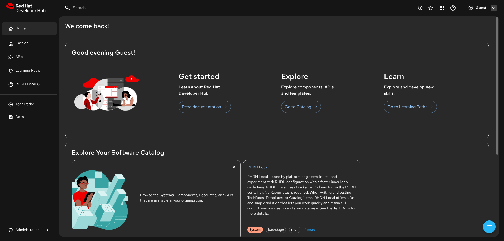

# Getting Started with RHDH Local

This guide walks you through setting up and using RHDH Local effectively, from initial installation to advanced configuration.

## Prerequisites

To use RHDH Local you'll need a few things:

1. A PC based on an x86_64 (amd64) or arm64 (aarch64) architecture
2. An installation of Podman (or Docker) (with adequate resources available)

   - [**Podman**](https://podman.io/docs/installation) v5.4.1 or newer; [**Podman Compose**](https://github.com/containers/podman-compose) v1.3.0 or newer.
   - [**Docker Engine**](https://docs.docker.com/engine/) v28.1.0 or newer; [**Docker Compose**](https://docs.docker.com/compose/) plugin v2.24.0 or newer.

3. An internet connection (for downloading container images, plugins, etc.)
4. (Optional) The `git` command line client for cloning this repository; or you can download and extract the [ZIP archive](https://github.com/redhat-developer/rhdh-local/archive/refs/heads/main.zip) from GitHub
5. (Optional) A GitHub account, if you want to integrate GitHub features into RHDH
6. (Optional) The node `npx` tool, if you intend to build dynamic plugins in RHDH. [Node.js](https://nodejs.org/en/download) v22.16.0 or newer is recommended to build, test, and run dynamic plugins effectively. This version of Node will also install [npx](https://docs.npmjs.com/cli/v11/commands/npx), which has been packaged with [npm](https://docs.npmjs.com/cli/v11/commands/npm) since v7.0.0 and newer.
7. (Optional) A [Red Hat account](https://access.redhat.com/RegistryAuthentication#getting-a-red-hat-login-2), if you want to use a PostgreSQL database or the commercially supported official RHDH images.

!!! tip "GUI Alternative for the Container Runtime"
    If you prefer graphical tools, consider [Podman Desktop](https://podman-desktop.io/) for easier container management.

## Quick Start (~5 Minutes)

### 1. Clone the repository

Clone this repository to a location on your PC and move to the `rhdh-local` folder.

```sh
git clone https://github.com/redhat-developer/rhdh-local.git && cd rhdh-local
```

### 2. (Optional) Create local `.env`

You can optionally create a local `.env` file and override any of the default variables defined in the `default.env` file. You can also add additional variables.

In most cases, when you don't need GitHub Authentication or testing different releases, you can skip this step.

### 3. (Optional) Create local configuration overrides

You can optionally customize the application configuration and dynamic plugins to load. See [Configuration Overview](./guides/configuration.md) for more details.

### 4. Start RHDH Local

Pick your container engine and run:

=== "Podman (Recommended)"
    ```bash
    podman compose up -d
    ```

=== "Docker"
    ```bash
    docker compose up -d
    ```

### 5. Access the Interface

Open your browser to: **http://localhost:7007**

You'll see the RHDH homepage once logged in. If GitHub authentication isn't configured, log in as **Guest**.

{ width="850" }

### 6. Explore Built-in TechDocs and test key features

- **TechDocs**: Look for "[Docs](/docs)" section with your configured documentation
- **Software Catalog**: Navigate to "[Catalog](/catalog)" in the sidebar
- **Templates**: Check "[Self-service](/create)" for available software templates
- **Plugins**: Verify some default plugins like [TechRadar](/tech-radar) appear in navigation

---

## Next Steps

Now that RHDH Local is running, explore these areas:

- **[Configuration](guides/configuration.md)**: Provide your own configuration files
- **[Loading Content](guides/loading-content.md)**: Add your catalogs, templates, and TechDocs
- **[Dynamic Plugin Management](guides/dynamic-plugins-management.md)**: Install and configure plugins
- **[GitHub Authentication](guides/github-auth.md)**: Set up GitHub integration for full functionality
- **[Local Plugin Development](guides/plugins-guide.md)**: Build and test custom plugins
- **[Operating RHDH Local](guides/operating-rhdh-local.md)**: Learn operational commands and maintenance

### Troubleshooting

If you encounter issues:

1. Review container logs: `podman compose logs`
2. Verify prerequisites and configuration syntax
3. Visit [Help & Contributing](help-and-contrib.md) for support options
