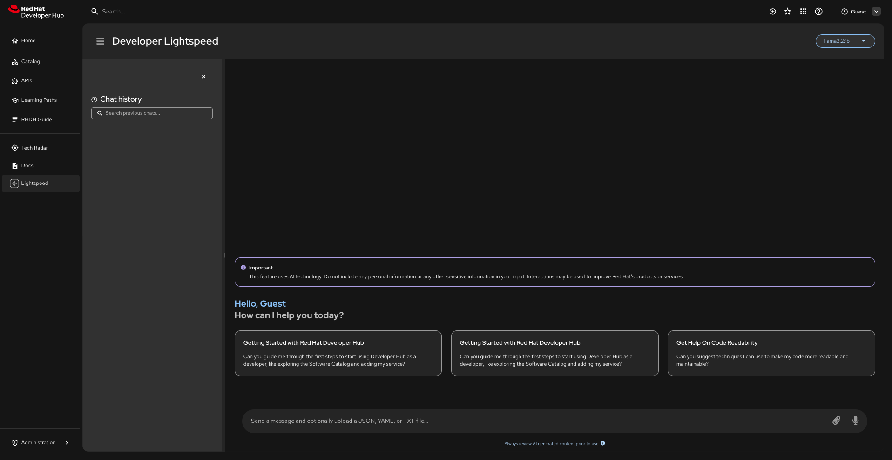

# Working with Developer Hub Intelligent Assistant

Developer Hub Intelligent Assistant is a virtual assistant powered by generative AI that offers in-depth insights into Red Hat Developer Hub (RHDH), including its wide range of capabilities. You can interact with this assistant to explore and learn more about RHDH in greater detail.

Developer Hub Intelligent Assistant provides a natural language interface within the RHDH console, helping you easily find information about the product, understand its features, and get answers to your questions as they come up.

Developer Hub Intelligent Assistant and OKP-backed Red Hat product documentation are included in RHDH Local by default. To make the chatbot functional, authenticate for the OKP image and enable an inference provider as described below. To disable it, see [Disabling Intelligent Assistant](#disabling-intelligent-assistant).

## Supported Architecture

Developer Hub Intelligent Assistant for Red Hat Developer Hub is available as a plug-in on all platforms that host RHDH, and it requires the use of Lightspeed Core.

Developer Hub Intelligent Assistant uses a **Bring Your Own Model (BYOM)** architecture. No inference provider is bundled by default — you must configure at least one external LLM provider. The application starts in an unconfigured state and the UI will reflect this until a provider is set up.

## Table of Contents
1. [Configure an Inference Provider](#configure-an-inference-provider)
2. [Query Validation Configuration](#query-validation-configuration-optional)
3. [OKP Document Retrieval](#okp-document-retrieval)
4. [Verify Services Are Running](#verify-services-are-running)
5. [Plugin Configuration Reference](#plugin-configuration-reference)
6. [Disabling Intelligent Assistant](#disabling-intelligent-assistant)
7. [Troubleshooting](#troubleshooting)

---

## Configure an Inference Provider

!!! important
  
    You **must** enable at least one inference provider before the chatbot will be functional. Without a configured provider, Developer Hub Intelligent Assistant will start in an unconfigured state.

    Do **not** edit the tracked file `configs/extra-files/lightspeed-stack.yaml`. It is synced from upstream and will be overwritten. Copy it to `lightspeed-stack.local.yaml` instead.

Enabling a provider is two steps:

1. Copy the tracked stack file to `lightspeed-stack.local.yaml` and uncomment the provider block(s).
2. Point compose at that file with `LIGHTSPEED_STACK_CONFIG` in `.env`, and set secrets and URLs there.

Compose interpolates `LIGHTSPEED_STACK_CONFIG` from the project `.env` (same as `VERTEX_AI_CREDENTIALS_PATH`). If it is unset, compose mounts the tracked `lightspeed-stack.yaml`.

If you don't already have a `.env` file, create one from the template:

```bash
cp default.env .env
```

!!! note

    **Supported Providers:**
    Developer Hub Intelligent Assistant supports any service that is **OpenAI API compatible**, including but not limited to:
    - **vLLM**: A high-performance inference server (self-hosted or cloud)
    - **OpenAI**: OpenAI's API (GPT-4, etc.)
    - **Ollama**: A locally or remotely hosted Ollama instance (via the `vllm` provider type)
    - **Vertex AI**: Google Cloud's Vertex AI service (experimental)

    Commented stubs in the synced stack file cover vLLM, OpenAI, and Vertex AI. Ollama is not a tracked stub — add it to `lightspeed-stack.local.yaml` as shown in Option C. Other OpenAI-compatible endpoints (Azure OpenAI, LM Studio, and similar) can use the **vLLM** provider block.

!!! note

    If you intend to use any environment variables in your local Lightspeed Core configuration file (`lightspeed-stack.local.yaml`), it is important to note that Lightspeed Core parses environment variables differently than what is typical. Environment variables for this file must be in the form:

    `${env.VAR}`

    `${env.VAR:=default-value}`

    `${env.VAR:+value}`

---

### 1. Create a local Lightspeed stack file

```bash
cp configs/extra-files/lightspeed-stack.yaml \
   configs/extra-files/lightspeed-stack.local.yaml
```

Edit `configs/extra-files/lightspeed-stack.local.yaml` and uncomment the provider block(s) you want (`vllm`, `openai`, and/or `vertexai`). For Ollama, paste the extra `vllm` block from Option C — it is not a commented stub in the tracked file. You can enable multiple providers. Leave secrets as `${env.VAR}` references — put the values in `.env`.

### 2. Point compose at the local file and set secrets

In `.env`:

```env
LIGHTSPEED_STACK_CONFIG=./configs/extra-files/lightspeed-stack.local.yaml
```

Configure **at least one** of the following providers in the same `.env` file, matching a block you uncommented in the local YAML.

After creating or editing the local stack file or changing `LIGHTSPEED_STACK_CONFIG`, recreate `lightspeed-core` (not only `rhdh`):

=== "Podman"
    ```bash
    podman compose up -d --force-recreate lightspeed-core
    # or: podman compose stop lightspeed-core && podman compose start lightspeed-core
    ```

=== "Docker"
    ```bash
    docker compose up -d --force-recreate lightspeed-core
    # or: docker compose stop lightspeed-core && docker compose start lightspeed-core
    ```

### Option A: vLLM Provider (or Any OpenAI API Compatible Endpoint)

Use vLLM for high-performance inference with self-hosted or cloud-based vLLM servers. **This provider configuration also works with any OpenAI API compatible service** (Azure OpenAI, LM Studio, Mistral, Nvidia NIM, etc.) that provides an OpenAI-compatible endpoint.

Uncomment the `vllm` block in `lightspeed-stack.local.yaml`, then set:

```env
# REQUIRED: URL to your server (must end with /v1)
# Examples:
#   - vLLM server: https://your-vllm-server.com/v1
#   - Azure OpenAI: https://your-resource.openai.azure.com/v1
#   - LM Studio: http://localhost:1234/v1
#   - Any OpenAI-compatible endpoint
VLLM_URL=https://your-server.com/v1

# REQUIRED: API key for authentication (if your server requires it)
# For Azure OpenAI, use your Azure API key
# For LM Studio or local servers, you can use any value or leave as default
VLLM_API_KEY=your-api-key-here

# OPTIONAL: Maximum tokens per request (default: 4096)
# VLLM_MAX_TOKENS=4096

# OPTIONAL: TLS verification (default: true)
# Set to false for local servers with self-signed certificates
# VLLM_TLS_VERIFY=true
```

!!! tip

    **Using Other OpenAI API Compatible Services:**

    If you have an OpenAI API compatible endpoint that doesn't have its own provider configuration (like Azure OpenAI, LM Studio, Mistral, Nvidia NIM, etc.), you can use the **vLLM provider configuration** above. Simply:
    1. Uncomment the `vllm` block in `lightspeed-stack.local.yaml`
    2. Set `LIGHTSPEED_STACK_CONFIG` in `.env` (step 2 above)
    3. Set `VLLM_URL` to your service's endpoint (must end with `/v1`)
    4. Set `VLLM_API_KEY` to your service's API key (if required)

    The `vllm` provider type accepts any OpenAI API compatible endpoint, not just vLLM servers.

### Option B: OpenAI Provider

Use OpenAI's API to access GPT models (GPT-4, etc.).

Uncomment the `openai` block in `lightspeed-stack.local.yaml`, then set:

```env
# REQUIRED: Your OpenAI API key
OPENAI_API_KEY=sk-your-openai-api-key-here
```

### Option C: Ollama Provider

Lightspeed Core does not implement Llama Stack's `remote::ollama` provider. Use a second `type: vllm` entry pointed at Ollama's OpenAI-compatible `/v1` API. Ollama is not a commented stub in the tracked stack file — add this under `inference.providers` in `lightspeed-stack.local.yaml` (keep `sentence_transformers` and any other providers you already enabled):

```yaml
    - type: vllm
      id: ollama
      extra:
        base_url: ${env.OLLAMA_URL:=http://localhost:11434/v1}
```

You must run your own Ollama server separately — it is not bundled in the compose setup. Then set in `.env`:

```env
# REQUIRED: URL to your Ollama server (must end with /v1)
# Examples:
#   - Local Ollama (Docker): http://host.docker.internal:11434/v1
#   - Local Ollama (Podman): http://host.containers.internal:11434/v1
#   - Remote Ollama: https://your-ollama-server.com:11434/v1
OLLAMA_URL=http://host.containers.internal:11434/v1
```

!!! note

    Since Ollama runs outside the compose stack, the URL must be reachable from the Lightspeed Core container. For a locally running Ollama, use `host.docker.internal` (Docker) or `host.containers.internal` (Podman) instead of `localhost`.

Give the Ollama entry a distinct `id` (for example `ollama`) if you also enable the commented `vllm` stub. Two `type: vllm` providers with the same id collide.

### Option D: Vertex AI Provider (Experimental)

Use Google Cloud's Vertex AI service to run Gemini models.

!!! warning
  
    **Experimental Feature:** Using Vertex AI to run Google models is experimental. Vertex AI provides an OpenAI-compatible API for Gemini models, which is why it can work with Developer Hub Intelligent Assistant (which supports OpenAI API implementations). This is provided as an alternative way to access Google models since `remote:gemini` is not yet fully supported.

Uncomment the `vertexai` block in `lightspeed-stack.local.yaml`, then set:

```env
# REQUIRED: Absolute path to your Google Cloud credentials JSON file
VERTEX_AI_CREDENTIALS_PATH=/absolute/path/to/your/google-cloud-credentials.json

# REQUIRED: Your GCP project ID
VERTEX_AI_PROJECT=your-gcp-project-id

# OPTIONAL: GCP location/region (default: global)
# VERTEX_AI_LOCATION=global
```

!!! note
  
    **To use Vertex AI, you need:**
    1. A Google Cloud Platform (GCP) project with Vertex AI API enabled
    2. A service account with appropriate permissions
    3. A service account key file (JSON) downloaded from GCP
    4. Set `VERTEX_AI_PROJECT` to your project ID
    5. Set `VERTEX_AI_CREDENTIALS_PATH` to the absolute path of your credentials JSON file

---

## Query Validation Configuration (Optional)

Developer Hub Intelligent Assistant supports query validation, which restricts the chatbot to RHDH-related questions. When enabled, off-topic queries (e.g., asking about the weather) will be rejected while development-related questions are allowed.

```env
# Enable query validation (stack YAML uses this as the shield provider_id)
ENABLE_VALIDATION=question_validity

# REQUIRED if validation is enabled: Must match a provider id you uncommented
# in lightspeed-stack.local.yaml (for example openai)
VALIDATION_PROVIDER=openai

# REQUIRED if validation is enabled: Must be an available model for that provider
# Example: VALIDATION_MODEL_NAME=gpt-4o-mini
VALIDATION_MODEL_NAME=gpt-4o-mini
```

!!! note
  
    The validation provider must be one of the inference providers you uncommented in `lightspeed-stack.local.yaml`, and the model must be available on that provider. Leave `ENABLE_VALIDATION` blank to keep validation disabled.

---

## OKP Document Retrieval

Offline Knowledge Portal (OKP) replaces the pre-built RHDH RAG image. It runs as a separate Compose service and provides product-document retrieval to Lightspeed Core.

Authenticate before starting RHDH Local:

```bash
podman login registry.redhat.io
# or: docker login registry.redhat.io
```

The tracked `lightspeed-stack.yaml` enables OKP as a `file_search` tool source. A local provider copy made from that file retains the OKP configuration. By default, Lightspeed Core reaches the host-published OKP endpoint at `http://host.docker.internal:8081`. LCORE uses this same base URL for generated citation links, so they are accessible from browsers on Podman/Docker Desktop. The endpoint is also available directly as `http://localhost:8081` on the host. If `host.docker.internal` is not resolvable on your host, set `OKP_SERVICE_URL` in `.env` to a hostname or IP that is reachable from both the container and browser.

### Running without OKP

You can run Developer Hub Intelligent Assistant without OKP and without authenticating to `registry.redhat.io`. Copy the provided Compose override:

```sh
cp compose.okp-disabled.override.example.yaml compose.override.yaml
```

The override keeps Lightspeed Core and the Intelligent Assistant plugins enabled, prevents the OKP service from starting, removes `OKP_SERVICE_URL`, and mounts `lightspeed-stack-no-okp.yaml`, which has no RAG configuration.

To configure an inference provider, create a local copy of the no-OKP configuration, uncomment the provider, and select it in `.env`:

```sh
cp configs/extra-files/lightspeed-stack-no-okp.yaml \
   configs/extra-files/lightspeed-stack-no-okp.local.yaml
```

```env
LIGHTSPEED_STACK_NO_OKP_CONFIG=./configs/extra-files/lightspeed-stack-no-okp.local.yaml
```

Start normally with `podman compose up -d` or `docker compose up -d`. The chatbot remains available, but answers do not include OKP-backed product documentation or citations. Delete `compose.override.yaml` to restore the default OKP-enabled deployment.

---

## Verify Services Are Running

After starting the application with `podman compose up -d` (or `docker compose up -d`), verify all services are running:

```bash
podman compose ps
# OR
docker compose ps
```

You should see output similar to:

| CONTAINER ID | IMAGE | CREATED | STATUS | NAMES |
|--------------|-------|---------|--------|-------|
| 31c3c681b742 | quay.io/rhdh-community/rhdh:next | 16 seconds ago | Exited (0) 5 seconds ago | rhdh-plugins-installer |
| f7b74b9f241e | quay.io/rhdh-community/rhdh:next | 4 seconds ago | Up 5 seconds (starting) | rhdh |
| a4e2b1f38d90 | registry.redhat.io/offline-knowledge-portal/rhokp-rhel9:... | 30 seconds ago | Up 20 seconds (healthy) | okp |
| 2860fc13b036 | quay.io/lightspeed-core/lightspeed-stack:dev-... | 15 seconds ago | Up 5 seconds (starting) | lightspeed-core |

- `rhdh-plugins-installer` is an init container — it runs once and exits with status `0`.
- `rhdh`, `okp`, and `lightspeed-core` should show `Up` or `running`; OKP should become healthy before Lightspeed Core starts.

Open http://localhost:7007/intelligent-assistant in your browser to access Developer Hub Intelligent Assistant.



---

## Plugin Configuration Reference

The Developer Hub Intelligent Assistant plugin can be configured in `configs/app-config/app-config.yaml`:

```yaml
intelligent-assistant:
  # OPTIONAL: Custom users prompts displayed to users
  # If not provided, the plugin uses built-in default prompts
  prompts:
    - title: <prompt_title>              # REQUIRED: Display title for the prompt
      message: <prompt_message>          # REQUIRED: The actual prompt text/question
  
  # OPTIONAL: Backend-only configurations
  servicePort: 8080                      # OPTIONAL: Port for Lightspeed Core service (default: 8080)
  systemPrompt: <custom_system_prompt>   # OPTIONAL: Override default RHDH system prompt
```

### Configuration Fields

| Field | Type | Required | Default | Description |
|-------|------|----------|---------|-------------|
| `prompts` | Array | No | Built-in prompts | Custom welcome prompts for users |
| `prompts[].title` | String | Yes* | - | Display title for the prompt (*required if prompts array is provided) |
| `prompts[].message` | String | Yes* | - | The actual prompt text/question (*required if prompts array is provided) |
| `servicePort` | Number | No | `8080` | Port for Lightspeed Core service |
| `systemPrompt` | String | No | RHDH default | Custom system prompt to override default behavior |

### Example Configuration

```yaml
intelligent-assistant:
  prompts:
    - title: "Quick Start"
      message: "How do I enable a dynamic plugin?"
  servicePort: 8080
  systemPrompt: "You are a helpful assistant focused on Red Hat Developer Hub development."
```

---

## Disabling Intelligent Assistant

If you don't configure an LLM provider, Developer Hub Intelligent Assistant will remain in an unconfigured/dormant state and not affect your RHDH experience.

To fully disable Developer Hub Intelligent Assistant:

1. **Stop the Developer Hub Intelligent Assistant services** by copying the provided example override file:

   ```sh
   cp compose.intelligent-assistant-disabled.override.example.yaml compose.override.yaml
   ```

   This prevents `okp` and `lightspeed-core` from starting. To re-enable, delete `compose.override.yaml`. If you already use `compose.override.yaml` for something else, merge the `profiles` snippet instead of replacing the file.

2. **Disable the Developer Hub Intelligent Assistant plugins** in your `configs/dynamic-plugins/dynamic-plugins.override.yaml`. If you don't have one yet, copy the example file:

   ```sh
   cp configs/dynamic-plugins/dynamic-plugins.override.example.yaml \
      configs/dynamic-plugins/dynamic-plugins.override.yaml
   ```

   Then add (or uncomment) the following entries in the `plugins` section, setting `enabled: false` on both the Developer Hub Intelligent Assistant frontend and backend plugins to remove all Developer Hub Intelligent Assistant UI elements:

   ```yaml
   plugins:
     # Disable Developer Hub Intelligent Assistant frontend plugin
     - package: 'ref://red-hat-developer-hub-backstage-plugin-intelligent-assistant'
       enabled: false

     # Disable Developer Hub Intelligent Assistant backend plugin
     - package: 'ref://red-hat-developer-hub-backstage-plugin-intelligent-assistant-backend'
       enabled: false
   ```

   !!! note
       Do **not** edit `configs/dynamic-plugins/dynamic-plugins.yaml` directly. The override file replaces the default configuration at runtime (see [How RHDH Local handles dynamic plugins configuration](../rhdh-local-guide/dynamic-plugins-management.md#how-rhdh-local-handles-dynamic-plugins-configuration)).

Step 1 alone stops the Lightspeed Core services but leaves the plugins installed (the UI may appear in a non-functional state). Step 2 removes the Developer Hub Intelligent Assistant UI elements entirely. Both steps are reversible.

---

## Troubleshooting

### 1. Services Not Starting or Exiting Unexpectedly

- **Check container logs:**  
  ```bash
  podman logs <container-name>
  # OR
  docker logs <container-name>
  ```

- **Common causes:**
  - Port conflicts (another service is using the same port)
  - Insufficient memory or CPU resources
  - Missing or expired `registry.redhat.io` authentication for the OKP image
  - Incorrect environment variables

### 2. "Permission Denied" or File Access Errors

- Ensure you have the necessary permissions to access files and directories, especially when mounting volumes.
- On Linux/macOS, you may need to adjust permissions with `chmod` or run commands with `sudo`.

### 3. Web UI Not Accessible at http://localhost:7007/intelligent-assistant

- Make sure all containers are running:
  ```bash
  podman compose ps
  # OR
  docker compose ps
  ```
- Check for firewall or VPN issues that may block access to localhost ports.

### 4. Chatbot Shows Unconfigured State

- Developer Hub Intelligent Assistant starts unconfigured by default. You must uncomment at least one inference provider in a local stack file and point compose at it.
- **Verify the local YAML**: `configs/extra-files/lightspeed-stack.local.yaml` exists and at least one provider is enabled (`vllm`, `openai`, `vertexai` uncommented, or an Ollama `type: vllm` block with `id: ollama`). Do not edit the tracked `lightspeed-stack.yaml`.
- **Verify `LIGHTSPEED_STACK_CONFIG`**: `.env` must set `LIGHTSPEED_STACK_CONFIG=./configs/extra-files/lightspeed-stack.local.yaml`. Compose interpolates this from the project `.env`; without it, the tracked stack file is mounted instead.
- **Check required `.env` keys**: Ensure secrets and URLs for your provider are set (`VLLM_URL` / `VLLM_API_KEY`, `OLLAMA_URL`, `OPENAI_API_KEY`, or `VERTEX_AI_*`). Provider `ENABLE_*` flags are not used.
- **Recreate `lightspeed-core`**: After editing the local stack file or `.env`, recreate `lightspeed-core` (`up -d --force-recreate lightspeed-core` or `stop`/`start`), not only `rhdh`.
- **Verify connectivity**: Ensure the provider URL is accessible from within the container.
- **Check logs**: Review `lightspeed-core` container logs for provider connection errors:
  ```bash
  podman logs lightspeed-core
  # OR
  docker logs lightspeed-core
  ```
- **Validate API keys**: Ensure API keys are correct and have proper permissions.

### 5. Environment Variables Not Set

- Double-check that your `.env` file is present and correctly configured.
- Restart the containers after making changes to environment files.

### 6. Query Validation Not Working

If you enabled query validation but it isn't filtering queries:

- **Verify validation is enabled**: Check that `ENABLE_VALIDATION=question_validity` is set in your `.env` file.
- **Check provider**: Ensure `VALIDATION_PROVIDER` is set to a provider id you uncommented in `lightspeed-stack.local.yaml`.
- **Check model**: Ensure `VALIDATION_MODEL_NAME` is set to a model available on the validation provider.

### 7. Still Stuck?

- Try stopping and removing all containers, then starting again:
  ```bash
  podman compose down --volumes
  podman compose up -d
  ```

If your issue persists, please reach out on Slack in `#forum-rhdh` with details about your problem so we can help you troubleshoot.
