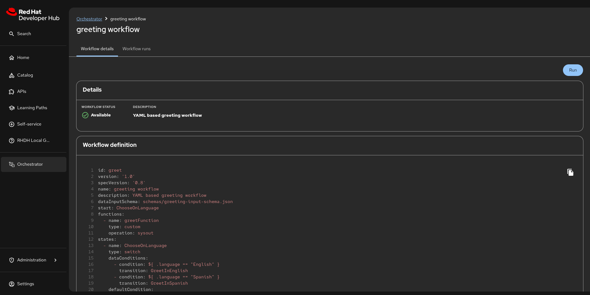

# Orchestrator in RHDH Local

Orchestrator brings serverless workflows into Red Hat Developer Hub (RHDH), focusing on the journey for application migration to the cloud, onboarding developers, and user-made workflows of RHDH actions or external systems.

