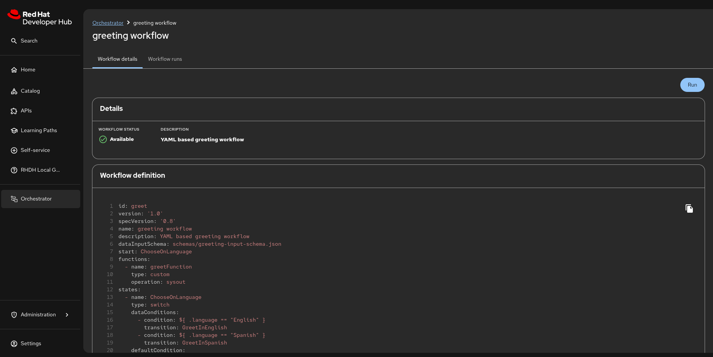
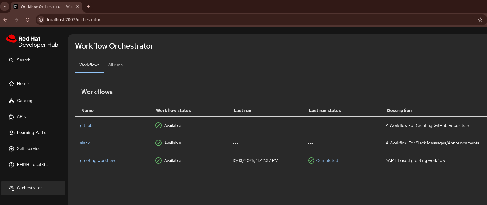

# Orchestrator in RHDH Local

Orchestrator brings serverless workflows into Red Hat Developer Hub (RHDH), focusing on the journey for application migration to the cloud, onboarding developers, and user-made workflows of RHDH actions or external systems.



## Getting Started

Before you begin, ensure to add the `orchestrator/configs/dynamic-plugins/dynamic-plugins.yaml` file to the
list of `includes` in your `configs/dynamic-plugins/dynamic-plugins.override.yaml` to enable orchestrator plugins within RHDH.
Example:

```yaml

includes:
  - dynamic-plugins.default.yaml
  - orchestrator/configs/dynamic-plugins/dynamic-plugins.yaml # <-- to add to enable the Orchestrator plugins

# Below you can add your own custom dynamic plugins, including local ones.
plugins: []
```

To set up the infrastructure for developing workflow with Orchestrator, you must merge and run these two compose files:
[`compose.yaml`](../compose.yaml) and [`orchestrator/compose.yaml`](./compose.yaml) configs.

To get started, run the command below or override the `RHDH_ORCHESTRATOR_WORKFLOWS` variable in your `.env` file to
point to your local workflow development directory before running the command.

```shell
podman compose -f compose.yaml -f orchestrator/compose.yaml up -d
```

Open http://localhost:7007/orchestrator and you will see the Orchestrator plugin enabled in the RHDH UI:



## Known Issues

While developing workflows and after making changes to your resources, the pages might error out. Reloading the page (a couple of times) may fix it. Otherwise, you may have to restart the `sonataflow` container by running:

```bash
podman compose -f compose.yaml -f orchestrator/compose.yaml stop sonataflow

podman compose -f compose.yaml -f orchestrator/compose.yaml start sonataflow
```

## Advanced

Please refer to the following docs (also rendered as built-in TechDocs in the running app):

- [Custom Configuration](../docs/orchestrator/config.md)
- [Workflows](../docs/orchestrator/workflows.md)
